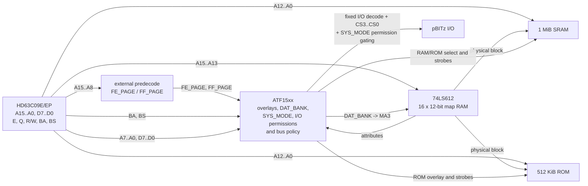

# Espresso-09 Architecture

**Status:** architectural baseline; schematic, CPLD fitter, and timing validation pending  
**Target CPU:** Hitachi HD63C09E / HD63C09EP  
**Primary OS:** NitrOS-9 Level 2  
**Physical memory target:** 1 MiB RAM + 512 KiB ROM in a 2 MiB address envelope  
**Logical address space:** 64 KiB  
**DAT block size:** 8 KiB

## 1. Design goals

Espresso-09 is the 6309 member of the pBITz coffee-machine family. The machine is intended to feel like a capable late-8-bit system rather than a literal clone of an existing computer.

The current architectural goals are:

- **1 MiB of RAM and 512 KiB of ROM** in a 2 MiB physical address envelope
- 128 physical RAM blocks of 8 KiB each, giving NitrOS-9 comfortable room for an EOU-style environment, resident modules, buffers, graphics/window services, and multiple processes
- a large, almost uninterrupted logical RAM workspace for the 6309 and GameOS-style allocators
- a permanent fixed I/O window that cannot disappear when the MMU DAT bank changes
- compatibility with the pBITz **4-bit Device Select** convention
- at least sixteen card-local register addresses per selected pBITz device
- hardware-enforced per-device I/O permissions for unprivileged software
- a real hardware privilege state that is independent of which LS612 DAT bank is selected
- a safe one-way hardware transition from unprivileged execution to the system map on interrupt, reset, and software-interrupt acknowledge
- hardware boot and interrupt vectors that are always reachable
- an instant-on NitrOS-9 image in ROM, followed by normal execution from RAM
- a memory-management design that fits NitrOS-9 Level 2 instead of reproducing a CoCo 3 GIME in a CPLD
- a conventional peripheral boundary between the host CPU and RX660 I/O Controller rather than a shared-memory transport
- deliberate external predecode and discrete CPU-clock logic where they materially reduce CPLD pin or logic pressure
- software-owned configuration state, with hardware readback reserved for state that hardware can create asynchronously

## 2. Architectural overview

The memory subsystem is divided between several devices with deliberately different jobs:

- the **74LS612** stores the actual translation entries and performs DAT translation
- simple **external combinational predecode** identifies the fixed `FEh` and `FFh` logical pages
- an **ATF15xx CPLD** implements DAT-bank selection, privilege state, interrupt/reset entry gating, boot/fixed overlays, mapper-register access, pBITz Device Select generation and permission gating, transfer qualification, and optional protection/fault policy
- discrete clock/cycle-extension logic generates the CPU clocks and MRDY behavior; the CPLD may observe CPU timing but is not the primary clock generator

The CPLD is not a second MMU. Espresso-09 uses the LS612 `MA3` input as the hardware DAT-bank selector and keeps privilege as separate CPLD state.



## 3. NitrOS-9 Level 2 memory and task model

NitrOS-9 Level 2 organizes a process address space as eight 8 KiB DAT blocks. Espresso-09 follows that model directly.

A key terminology distinction is required: **NitrOS-9 software tasks are not the same thing as the two hardware DAT banks** provided by the CoCo 3 GIME or by Espresso's LS612 arrangement.

NitrOS-9 Level 2 has a software task-number namespace of `0..31`. Each allocated software task has an eight-byte DAT image kept in system memory. The reference Level 2 kernel reserves software task 0 for the system and begins ordinary task allocation at task 2; in the CoCo 3/EOU configuration software task 1 is reserved for GrfDrv. Those software task numbers do not imply thirty-two simultaneously resident hardware DAT maps.

The LS612 contains sixteen mapping registers, so Espresso divides them into two complete **hardware DAT banks**:

```text
entries 0..7    hardware DAT bank 0: system map
entries 8..15   hardware DAT bank 1: working map
```

The map-address inputs are:

```text
MA0 = CPU A13
MA1 = CPU A14
MA2 = CPU A15
MA3 = DAT_BANK
```

Therefore:

```text
DAT_BANK = 0   -> hardware DAT bank 0, entries 0..7
DAT_BANK = 1   -> hardware DAT bank 1, entries 8..15
```

`DAT_BANK` is a **hardware map selector**, not a NitrOS-9 software task number and not a privilege indicator.

CPU `A12..A0` bypass the mapper and form the offset within the selected 8 KiB block.

NitrOS-9 keeps the DAT image for each software task in kernel memory. When execution must move to a software task whose DAT image is not already resident in hardware DAT bank 1, the kernel copies that task's eight physical-block bytes into LS612 entries 8..15. Hardware DAT bank 0 normally remains the resident system map.

The normal Level 2 implementation treats hardware DAT bank 1 as a small cache of the currently required software-task DAT image. The kernel remembers which software task image is resident; if the same task is reused and its DAT image has not changed, the eight mapper registers need not be rewritten. If the task changes, or if its DAT image has been modified, the working bank is reloaded.

Conceptually:

```text
NitrOS-9 software tasks in system RAM

software task 0  -> 8-byte DAT image
software task 1  -> 8-byte DAT image
software task 2  -> 8-byte DAT image
...
software task 31 -> 8-byte DAT image
                         |
                         | selected task changes
                         | or DAT image changes
                         v
                 LS612 hardware DAT bank 1
                      entries 8..15
```

This means that copying an eight-byte DAT image into the working hardware bank on a process/task switch is **the expected NitrOS-9 Level 2 execution model**, not an Espresso-specific penalty imposed by the LS612. Espresso intentionally follows that model rather than providing one hardware DAT bank per software task.

### 3.1 DAT bank and privilege are separate state

Espresso adds a one-bit CPLD privilege latch named `SYS_MODE`:

```text
SYS_MODE = 1   privileged/system execution
SYS_MODE = 0   unprivileged execution
```

`SYS_MODE` is deliberately independent of `DAT_BANK`. The useful states are:

| `DAT_BANK` | `SYS_MODE` | Meaning |
| ---: | ---: | --- |
| 0 | 1 | normal kernel/system execution using the resident system map |
| 1 | 1 | privileged execution using the working DAT bank, e.g. a GrfDrv-style system task |
| 1 | 0 | ordinary unprivileged process execution |
| 0 | 0 | forbidden; hardware/software must not create this state |

The separation is required because NitrOS-9 may legitimately execute privileged system software through the working DAT bank. In particular, the CoCo 3/EOU convention reserves software task 1 for GrfDrv while still loading its DAT image into the same working hardware bank used for ordinary process tasks.

The privilege model therefore never assumes:

```text
DAT_BANK = 0  <=> privileged
DAT_BANK = 1  <=> unprivileged
```

Instead, memory protection, privileged control-register access, and pBITz permission bypass are all based on `SYS_MODE`.

The 2 MiB physical envelope gives the mapper a full eight-bit physical block number. Espresso populates the lower 128 block numbers (`00h-7Fh`) as RAM, so the NitrOS-9 RAM allocator can use ordinary one-byte DAT values without any Espresso-specific packing or truncation.

This preserves the useful NitrOS-9 concepts:

- eight 8 KiB blocks per process
- eight-byte process/task DAT images
- up to 32 NitrOS-9 software task numbers
- an always-available system hardware DAT bank
- one working hardware DAT bank for the currently required software task
- software storage of additional task/process DAT images
- cached working-bank reloads rather than unconditional mapper writes when the same unchanged task remains resident
- privileged system execution through either hardware DAT bank when required
- existing `F$MapBlk`, `F$Move`, module-sharing, and process-memory concepts

No CoCo-compatible GIME peripheral behavior is implied or required.

## 4. Logical address space

The current baseline keeps the DAT-translated region contiguous until the last 512 bytes of the CPU address space.

| Logical range | Size | Function | Mapping task-dependent? |
| --- | ---: | --- | --- |
| `0000h-FDFFh` | 63.5 KiB | DAT-translated memory | Yes |
| `FE00h-FEFFh` | 256 B | Fixed pBITz I/O aperture | No |
| `FF00h-FF1Fh` | 32 B | Fixed MMU/control registers | No |
| `FF20h-FFEFh` | 208 B | Fixed common RAM / task-switch and privilege trampoline code | No |
| `FFF0h-FFFFh` | 16 B | Fixed vector window | No |

The fixed ranges are CPLD overlays on top of the otherwise normal logical block 7 translation.

The pBITz aperture is fixed in the logical address space, but **fixed visibility does not imply unrestricted access**. Privileged execution (`SYS_MODE=1`) may always perform pBITz transfers. Unprivileged transfers (`SYS_MODE=0`) are qualified by a sixteen-bit Device Select permission mask described below.

The exact physical backing of the common/vector RAM remains an implementation detail. A reserved region of main SRAM is the current assumption; the hardware design must ensure that it cannot be accidentally allocated as ordinary process memory.

### 4.1 Why the fixed region is at the top

Putting fixed I/O and common state at the top leaves the CPU with one large unbroken translated workspace from `0000h` through `FDFFh`.

This is useful for:

- 6309 `TFM` operations
- simple linear allocators
- large contiguous process address spaces
- avoiding an I/O hole in the middle of normal RAM
- executing the privilege-entry/return trampoline while `DAT_BANK` changes

### 4.2 External `FEh` / `FFh` page predecode

The fixed locations of the pBITz and MMU/common/vector windows are intentional enough that Espresso does not need to spend CPLD pins preserving arbitrary relocation of those pages.

Simple external combinational logic therefore predecodes the CPU high address byte into two qualifiers:

```text
FE_PAGE = 1 when CPU A15..A8 = FEh
FF_PAGE = 1 when CPU A15..A8 = FFh
```

The CPLD receives `FE_PAGE`, `FF_PAGE`, and CPU `A7..A0` rather than receiving `A15..A8` solely to rediscover those two fixed pages internally. CPU `A15..A13` still connect directly to the LS612 as mapper-address inputs and are unaffected by this choice.

Using two page qualifiers in place of eight high-address inputs saves **six general-purpose CPLD pins**. The tradeoff is deliberate: moving the fixed I/O/control pages would require changing the external predecode hardware rather than only changing CPLD equations. For Espresso, that loss of flexibility is considered a small price for lower CPLD pin pressure and simpler decode equations.

Optional diagnostics must not force those high address bits back into the CPLD merely to report a logical block number. If detailed memory-fault address capture later proves valuable, its implementation should be budgeted explicitly rather than assumed to be free.

## 5. pBITz I/O window

The `FE00h-FEFFh` range is permanently decoded at a fixed logical address and is independent of the current LS612 map. `FE_PAGE` supplies the high-page qualification; CPU `A7..A4` then select one of sixteen pBITz Device Select values **at the Espresso-side CPLD**. The CPLD drives that four-bit value onto the pBITz bus control signals `CS3..CS0`:

```text
CPU logical address

FE D x
   | |
   | +-- A3..A0 remain available for card-local sub-decoding
   |
   +---- A7..A4 = D
              |
              v
       Espresso CPLD
              |
              v
        bus CS3..CS0
              |
              v
   compared with each card's
   4-bit rotary-switch setting
```

The peripheral cards do **not** determine selection by comparing CPU address bits `A7..A4`. They compare the pBITz control signals `CS3..CS0` against their configured Device Select value.

Once a card is selected, it may use whichever ordinary address lines it needs for its own register decoding. In a sixteen-byte Device Select slot, `A3..A0` provide up to sixteen distinct host addresses; many peripherals need only `A0`, `A1`, or `A2`, while devices with sixteen registers can use `A3..A0`.

This separation is intentional:

```text
host address decode        card-local decode
-------------------        -----------------
A7..A4 -> CPLD             A0..A3 as needed
          |
          v
       CS3..CS0 ----------> card select comparator
```

The address decode and generated `CS3..CS0` value do not depend on LS612 contents or `DAT_BANK`. Whether a **valid pBITz transfer is emitted**, however, is qualified by `SYS_MODE` and the Device Select permission mask.

The selected host interface for the RX660 I/O Controller is a **W65C22S VIA**. Its sixteen host-visible registers fit naturally into one pBITz Device Select slot. The exact Device Select value is not yet frozen; whichever value is chosen will be presented to the VIA card as the corresponding `CS3..CS0` bus value.

### 5.1 Unprivileged Device Select protection

The CPLD contains a sixteen-bit register named `USER_IO_MASK`:

```text
USER_IO_MASK[0]    permission for Device Select 0
USER_IO_MASK[1]    permission for Device Select 1
...
USER_IO_MASK[15]   permission for Device Select 15
```

The bit semantics are:

```text
0 = unprivileged software may not access this Device Select
1 = unprivileged software may access this Device Select
```

Privileged execution always has access regardless of the mask.

For an access in `FE00h-FEFFh`:

```text
device_select = A7..A4

pbitz_cycle_allowed =
    (SYS_MODE == 1)
    OR USER_IO_MASK[device_select]
```

Conceptually:

```text
                           USER_IO_MASK[15:0]
                                  |
                                  v
A7..A4 -> Device Select ----> permission lookup
       |                          |
       |                          v
       +-> CS3..CS0        unprivileged allowed?
                                  |
SYS_MODE -------------------------+
                                  |
                                  v
                         pBITz transfer enable
```

The Device Select value can still be encoded on `CS3..CS0`; the protection mechanism must suppress the **card-side transfer qualification/strobe** when access is denied so that no read-sensitive or write-sensitive peripheral operation occurs. The final pBITz electrical implementation must ensure that raw CPU `E`, `R/W`, or other ungated bus signals cannot create a real peripheral transfer after the CPLD has denied it.

Reset initializes:

```text
USER_IO_MASK = 0000h
```

so unprivileged code initially has no direct peripheral access. This is the intended NitrOS-9 policy: ordinary user processes normally reach hardware through system calls and kernel drivers, which execute with `SYS_MODE=1`.

The kernel may deliberately set individual mask bits when direct device access is useful. For example, a GameOS-style environment could grant a game direct access to video and sound Device Selects while retaining privileged-only access to storage and system-control devices.

The mask is one hardware register associated with unprivileged execution policy. Software may treat it as global policy, or save and restore it as part of a process context if per-process I/O grants are desired.

### 5.2 Denied-cycle behavior

The HD63C09 has no bus-error input and cannot restart a faulting I/O instruction. Denied I/O therefore uses simple deterministic completion semantics:

- denied writes are discarded and must never reach the peripheral
- denied reads return a defined idle value, preferably `FFh`
- the CPLD may latch an `IO_PROTECTION` fault cause, Device Select, `DAT_BANK`, `SYS_MODE`, and read/write direction for diagnostics
- an optional `FIRQ` may be generated when fault interrupts are enabled

The exact electrical method used to return `FFh` on a denied read remains an implementation detail. It may use a qualified data-bus driver, defined bus pull-ups, or another method that guarantees a non-floating result.

## 6. Physical memory map

Espresso-09 uses a **21-bit / 2 MiB physical address envelope**:

| Physical range | Block range | Size | Function |
| --- | --- | ---: | --- |
| `000000h-0FFFFFh` | `00h-7Fh` | 1 MiB | SRAM |
| `100000h-17FFFFh` | `80h-BFh` | 512 KiB | Reserved / unpopulated |
| `180000h-1FFFFFh` | `C0h-FFh` | 512 KiB | ROM |

With 8 KiB blocks:

```text
2 MiB / 8 KiB = 256 physical blocks
```

so a translated block number is exactly eight bits.

The block namespace is intentionally simple:

```text
00h-7Fh   RAM blocks (128 blocks = 1 MiB)
80h-BFh   reserved / unpopulated
C0h-FFh   ROM blocks (64 blocks = 512 KiB)
```

In terms of the high physical block bits:

```text
B7 = 0              RAM
B7 = 1, B6 = 0      reserved
B7 = 1, B6 = 1      ROM
```

A logical address is translated as:

```text
physical_address = (physical_block << 13) | logical_address[12:0]
```

The reserved `80h-BFh` range is outside the initial RAM and ROM population. Accesses to those blocks should not select any memory device and may be treated as invalid/unimplemented physical mappings by the CPLD policy logic.

### Examples

If logical block 5 maps physical RAM block `23h`:

```text
logical address:   BABC
block offset:      1ABC
physical block:    23
physical address:  047ABC
```

If the same logical block maps ROM block `E3h`:

```text
logical address:   BABC
block offset:      1ABC
physical block:    E3
physical address:  1C7ABC
```

## 7. LS612 entry format

Each LS612 mapping register stores twelve bits.

The 2 MiB physical envelope requires eight physical-block bits, leaving **four bits of per-entry metadata**:

```text
+----------------------+-------------------------+
| 4 attribute bits     | 8-bit physical block    |
+----------------------+-------------------------+
```

The recommended physical-block output wiring preserves the useful pass-mode identity map:

| LS612 output | Physical address | Meaning |
| --- | --- | --- |
| `MO8` | `PA13` | block bit B0 |
| `MO9` | `PA14` | block bit B1 |
| `MO10` | `PA15` | block bit B2 |
| `MO4` | `PA16` | block bit B3 |
| `MO5` | `PA17` | block bit B4 |
| `MO6` | `PA18` | block bit B5 |
| `MO7` | `PA19` | block bit B6 |
| `MO11` | `PA20` | block bit B7 |
| `MO0..MO3` | CPLD | four attribute bits |

During pass mode the reset design forces `MA3` / `DAT_BANK` low. With the pass-through outputs arranged as above, logical `0000h-FFFFh` therefore remains an identity mapping onto the first 64 KiB of physical RAM even though `MO11` is now the normal mapped-mode `PA20` output.

The mapper register-data path can remain especially natural for NitrOS-9: an ordinary DAT write is a **single eight-bit physical block number**. The CPLD supplies or stages the four Espresso-specific attribute bits independently.

Software and hardware must distinguish the populated block classes:

- `00h-7Fh` are normal allocatable RAM blocks
- `80h-BFh` are reserved/unimplemented in the baseline machine
- `C0h-FFh` are ROM blocks and may be mapped for bootstrap, recovery, or diagnostics

## 8. Per-entry attributes

Four attribute bits are available. A useful initial policy is:

| Attribute | Purpose |
| --- | --- |
| `WRITE_PROTECT` | suppress writes to the mapped block |
| `SYSTEM_ONLY` | deny access while `SYS_MODE=0` |
| `INVALID` | mark the entry unmapped and fault accesses |
| reserved | future debug/watch/shared-memory use |

Attribute value zero should mean a normal valid writable mapping.

Attributes are an Espresso-specific extension. NitrOS-9 process DAT images should remain eight ordinary block-number bytes.

### 8.1 Attribute staging and interrupt safety

The preferred programming model is a one-shot CPLD staging register with an explicit valid bit:

```text
write MMU_ATTR:
    ATTR_LATCH <- attribute bits
    ATTR_VALID <- 1

write any LS612 mapper entry:
    physical block <- CPU data byte

    if ATTR_VALID:
        attributes <- ATTR_LATCH
    else:
        attributes <- DEFAULT

    ATTR_VALID <- 0          // unconditional
```

The unconditional clear on **every** mapper-entry write prevents a stale override from leaking into a later, unrelated DAT write.

The `MMU_ATTR` write plus the mapper-entry write is a two-step software transaction and is not intrinsically atomic. Software using non-default attributes must therefore treat the pair as a critical sequence:

- mask IRQ and FIRQ before writing `MMU_ATTR`
- perform the intended mapper-entry write immediately afterward
- restore interrupt masks only after the mapper write has completed
- NMI handlers must not write mapper entries or otherwise consume pending attribute state

Normal NitrOS-9 DAT-image loads use default attributes and do not need this two-step sequence. The critical-section rule applies only to Espresso-specific protected/invalid/diagnostic mappings that use `MMU_ATTR` staging.

## 9. Fixed MMU/control interface

The proposed fixed control block is `FF00h-FF1Fh`, qualified by external `FF_PAGE` predecode.

A practical register layout is:

| Offset | Function | Direction |
| ---: | --- | --- |
| `00h-07h` | hardware DAT bank-0 LS612 entries | write |
| `08h-0Fh` | hardware DAT bank-1 LS612 entries | write |
| `10h` | `MMU_ATTR` staging register | write |
| `11h` | `MMU_CTRL` / `DAT_BANK`, `SYS_MODE`, and boot controls | write |
| `12h` | optional hardware fault/status | read |
| `13h` | optional hardware fault detail | read |
| `14h` | reserved | — |
| `15h` | `USER_IO_MASK_LO` — permissions for Device Selects 0-7 | write |
| `16h` | `USER_IO_MASK_HI` — permissions for Device Selects 8-15 | write |
| `17h-1Fh` | reserved | — |

The LS612 register-select inputs can be wired directly from CPU `A0..A3` for the sixteen mapper entries.

Mapper-register cycles must suppress normal RAM, ROM, and pBITz transfer strobes because mapper outputs are not meaningful as normal memory addresses during register access.

All writes to privileged MMU/control state, including `MMU_ATTR`, LS612 entry programming, `DAT_BANK`, `SYS_MODE`, boot controls, and `USER_IO_MASK`, require `SYS_MODE=1`. Unprivileged writes must be ignored or faulted in hardware.

This means user code cannot simply write `MMU_CTRL` to select hardware DAT bank 0 or assert privilege. The only unprivileged-to-privileged transition is the hardware entry gate described in §12.

Privileged software may deliberately select either DAT bank. In particular:

```text
DAT_BANK=0, SYS_MODE=1    normal kernel/system map
DAT_BANK=1, SYS_MODE=1    privileged working-map execution
```

Return to ordinary user execution must be issued from fixed privileged trampoline code as a controlled transition to:

```text
DAT_BANK=1, SYS_MODE=0
```

The exact `MMU_CTRL` bit/command encoding is not frozen, but the architecture requires that this return transition cannot be initiated while `SYS_MODE=0` and that the forbidden `DAT_BANK=0, SYS_MODE=0` state cannot be created.

The `USER_IO_MASK` power-on/reset value is `0000h`. Privileged execution is not subject to the mask.

### 9.1 Write-only configuration and software shadows

CPLD and mapper configuration state is **software-owned**. The baseline architecture does not provide hardware readback merely so software can rediscover values that the kernel itself wrote.

The NitrOS-9 port keeps authoritative shadows in system/fixed RAM for configuration such as:

- the eight-byte DAT images already maintained for NitrOS-9 software tasks
- any Espresso-specific mapper attributes associated with those mappings
- `USER_IO_MASK`
- requested `MMU_CTRL` / boot-overlay state
- the execution state that must be restored after an interrupt

`MMU_ATTR` is transient write-only staging state and does not require readback. Likewise, reading LS612 entries back is unnecessary because NitrOS-9's RAM-resident DAT images are already the canonical copies.

`DAT_BANK` and `SYS_MODE` also do not require ordinary control-register readback. Interrupt/reset acknowledge may change them in hardware before kernel code executes, so readback after entry could not reconstruct the pre-interrupt state anyway. Fixed/common software must therefore shadow the intended execution state needed for restoration, including the distinction between privileged system-map, privileged working-map, and unprivileged working-map execution.

Only state that can be **created or changed asynchronously by hardware** needs a read path. Optional `FAULT_STATUS`, `FAULT_DETAIL`, or future bus/error status are examples. If those diagnostics are not implemented, the baseline CPLD need not drive the CPU data bus at all; `D7..D0` may remain input-only to the CPLD for configuration writes.

This write-oriented interface is intentional. It avoids an otherwise unnecessary multi-source CPU-data read mux, output-enable equations, and product-term/macrocell consumption.

## 10. Reset and boot mapping

The LS612 mapping RAM has no guaranteed useful power-up contents. Espresso-09 must therefore not depend on map-register state at reset.

### 10.1 Reset defaults

Reset must force:

```text
LS612 pass mode
DAT_BANK = 0
SYS_MODE = 1
mapper register interface inactive
ATTR_VALID = 0
memory write strobes inactive
boot ROM overlay enabled
USER_IO_MASK = 0000h
```

The pass-mode wiring is chosen so the untranslated CPU address appears as the first 64 KiB of physical RAM:

```text
logical 0000h-FFFFh -> physical RAM 000000h-00FFFFh
```

The CPLD then overlays boot ROM and fixed regions at the top of the logical address space.

A practical reset view is:

```text
0000h-DFFFh   identity-mapped RAM
E000h-FDFFh   boot ROM overlay
FE00h-FEFFh   fixed pBITz I/O aperture
FF00h-FF1Fh   fixed MMU/control
FF20h-FFFFh   boot ROM/common/vector overlay
```

The final boot-ROM split may move slightly during CPLD fitting, but the reset vector at logical `FFFEh-FFFFh` must always come from ROM while reset/boot mode is active.

The boot overlay uses the final physical ROM block (`FFh`) as the natural bootstrap/vector block. The absolute end of ROM is therefore physical `1FFFFFh`, with the reset vector bytes at `1FFFFEh-1FFFFFh`.

### 10.2 Hardware-safe reset behavior

The board should establish safe mapper and memory states even before the CPLD image is fully active:

- pull LS612 mode toward pass mode
- keep LS612 register `CS` and `STROBE` inactive
- force `MA3`/`DAT_BANK` low
- force or reset `SYS_MODE` to privileged state
- keep RAM and ROM write strobes inactive through hardware-safe defaults
- clear `ATTR_VALID`
- reset the unprivileged pBITz permission mask to all denied
- do not rely on uninitialized CPLD outputs to prevent accidental memory or peripheral writes

## 11. ROM shadowing and instant-on NitrOS-9

The ROM is intended to contain an immediately bootable Espresso system image, including the NitrOS-9 components needed for startup.

Normal runtime execution should occur from RAM.

A baseline cold-start sequence is:

1. **Reset in pass mode.** `DAT_BANK=0`, `SYS_MODE=1`, and the boot overlay supplies the reset vector.
2. **Enter the bootstrap.** Establish a stack in known RAM and keep interrupts masked.
3. **Initialize LS612 hardware DAT bank 0.** Create a safe initial system DAT while boot ROM remains overlaid.
4. **Initialize LS612 hardware DAT bank 1.** Start with a known working map or invalid entries as appropriate.
5. **Initialize I/O policy.** Leave `USER_IO_MASK = 0000h` for the default NitrOS-9 policy unless early direct user access is explicitly required.
6. **Enter map mode.** The bootstrap is still executing from the fixed ROM overlay, so changing the translated lower memory cannot remove the current instruction stream.
7. **Shadow ROM to RAM.** Use two temporary 8 KiB hardware-bank-0 windows: one mapped to a ROM block and one to the corresponding RAM shadow block. Copy with `TFM` and repeat for the ROM image.
8. **Install the runtime system map.** Point hardware DAT bank 0 at the RAM-resident NitrOS-9 image and initialize common/vector RAM.
9. **Move the bootstrap stack if necessary.** The block containing the active stack must never be overwritten while it is in use; a full 512 KiB shadow copy must handle the bootstrap/common block last or relocate the stack first.
10. **Prepare a RAM-resident handoff stub.** The instruction that disables the boot overlay must not be followed by an instruction that existed only in the disappearing ROM window.
11. **Jump to the RAM stub and disable the boot ROM overlay.** Fixed I/O, MMU/control, common RAM, and vectors remain visible.
12. **Enter NitrOS-9 cold start from RAM.** Normal mappings now use RAM; privileged execution remains `SYS_MODE=1`, and user execution is entered later through the fixed return trampoline.

For a simple one-to-one 512 KiB ROM shadow, the physical copy pairing is:

```text
ROM block C0h -> RAM block 00h
ROM block C1h -> RAM block 01h
...
ROM block FFh -> RAM block 3Fh
```

This leaves RAM blocks `40h-7Fh`—the upper 512 KiB of system RAM—untouched by the full shadow operation and immediately available to NitrOS-9.

Copying the complete ROM does not mean RAM blocks `00h-3Fh` must remain permanently occupied. Once NitrOS-9 is running, blocks containing no live kernel/module data can be treated as free and overwritten normally.

The architecture also permits a future optimized boot that copies only populated/live ROM blocks; the full-shadow sequence remains the simple baseline.

## 12. Privilege entry, runtime vectors, and common trampoline

The top 256 bytes are divided between control, common code, and vectors so that privilege and DAT-bank changes cannot remove the code needed to perform the transition itself.

`FF20h-FFEFh` is intended for small fixed routines and state such as:

- privilege-entry and return trampolines
- DAT-bank switching glue
- interrupt/system-call entry and return glue
- temporary execution-context state
- code that must execute while `DAT_BANK` changes

`FFF0h-FFFFh` contains the fixed hardware vector window.

At reset, the vector window is supplied by ROM. Before the boot overlay is removed, bootstrap code must initialize the runtime vector backing in fixed common RAM. After handoff, interrupt and software-interrupt vectors therefore remain independent of the selected DAT bank.

### 12.1 Hardware one-way privilege entry

The CPLD must monitor the 6309 `BA`/`BS` bus-status signals and recognize the CPU's Interrupt/Reset Acknowledge state. The architecture requires that the acknowledge state used for RESET, NMI, FIRQ, IRQ, SWI, SWI2, and SWI3 provide the hardware privilege-entry event; exact HD63C09E timing must still be validated against the selected CPU data sheet before schematic commitment.

On the acknowledge event, the CPLD **latches**:

```text
DAT_BANK <- 0
SYS_MODE <- 1
```

This is a persistent state change, not merely a combinational override of `MA3` while `BA`/`BS` remain asserted. When the acknowledge bus state ends, the CPU must continue executing with hardware DAT bank 0 selected and with privileged access enabled.

The transition is safe because the same interrupt/software-interrupt event also fetches the new PC through the fixed vector overlay. The CPU therefore does not execute an attacker-controlled next instruction after privilege changes. The vector target is fixed common trampoline code, which establishes the kernel stack and execution state before branching into ordinary kernel code.

Conceptually:

```text
unprivileged process
DAT_BANK=1, SYS_MODE=0
          |
          | IRQ/FIRQ/NMI/SWI/SWI2/SWI3 acknowledge
          v
hardware entry gate
DAT_BANK=0, SYS_MODE=1
          |
          | fixed vector fetch
          v
fixed common trampoline
          |
          v
kernel/system code
```

This one-way gate is the point where Espresso intentionally diverges from a stock CoCo 3 NitrOS-9 port. The CoCo 3 does not enforce hardware privilege and kernel-entry code may freely manipulate the GIME task selector. Espresso user code cannot write `MMU_CTRL`, so the Espresso NitrOS-9 port must rely on the hardware acknowledge gate for unprivileged-to-system entry rather than attempting to perform the initial DAT-bank switch itself.

The hardware gate does **not** reload or reshuffle LS612 entries. It only selects the already resident system hardware DAT bank and asserts privilege.

### 12.2 Explicit privileged return

Returns remain explicit. From fixed common privileged code, the kernel prepares the user stack/context and then performs a controlled `MMU_CTRL` transition to:

```text
DAT_BANK=1
SYS_MODE=0
```

The following `RTI` executes from the fixed trampoline, so changing the DAT bank cannot replace the current instruction stream. After `RTI`, execution resumes in the selected user task's working map.

Privileged system code may also intentionally execute through the working bank by selecting:

```text
DAT_BANK=1
SYS_MODE=1
```

A GrfDrv-style system task is the motivating example.

Because an interrupt acknowledge forces the system map, the Espresso kernel-entry/return glue must preserve enough software execution-context state to restore a privileged working-map context when such code is interrupted. This state can live in fixed common/kernel RAM; it does not inherently require another hardware DAT bank or another CPLD privilege-state bit. NMI interaction with the entry trampoline and system-stack establishment must be included in hardware/software validation.

## 13. Context switching

NitrOS-9 software tasks and Espresso hardware DAT banks have different lifetimes. Hardware DAT bank 0 remains the resident system map. Hardware DAT bank 1 is a **working map** that is loaded from the eight-byte DAT image of whichever NitrOS-9 software task currently needs to execute.

A normal switch to a different software task is therefore:

```text
select software task
        |
        v
locate its 8-byte DAT image in kernel RAM
        |
        v
if it is not already resident, or its DAT image changed:
    load 8 physical-block bytes into LS612 entries 8..15
        |
        v
from fixed privileged trampoline, select required execution state
```

The Espresso NitrOS-9 port should maintain a software cache tag equivalent in purpose to the reference kernel's `D.Task1N`: it records which NitrOS-9 software task image is currently resident in hardware DAT bank 1. If the scheduler returns to that same software task and its DAT image is unchanged, the LS612 entries need not be rewritten. Any operation that changes the task's DAT image must invalidate that cached identity so the next return reloads the working bank.

This is the normal NitrOS-9 Level 2 model. The reference kernel likewise keeps software task DAT images in a task-image table and copies the selected eight-byte image into the working hardware DAT bank as needed. The LS612's two-bank organization is therefore a direct fit for the expected operating-system behavior rather than a context-switch disadvantage relative to the standard architecture.

Software task 1 is a useful illustration of the distinction: in the CoCo 3/EOU configuration it is reserved for GrfDrv, yet GrfDrv still runs by loading its DAT image into the same hardware working bank used for ordinary process tasks. Espresso does not need a third hardware DAT bank to support that arrangement; it can run the working bank with `SYS_MODE=1`.

System calls and interrupts from unprivileged execution enter hardware DAT bank 0 through the acknowledge gate described in §12. The fixed common trampoline moves to a known system stack before performing substantial work.

Return to an ordinary user process sets `DAT_BANK=1, SYS_MODE=0` from fixed privileged code immediately before `RTI`. Return to privileged working-map software instead uses `DAT_BANK=1, SYS_MODE=1`.

The baseline NitrOS-9 policy can leave `USER_IO_MASK = 0000h` for every ordinary process. If a future environment assigns different direct-I/O privileges to different processes, the kernel may save and restore the sixteen-bit mask alongside the software DAT/process context before entering `SYS_MODE=0`.

This is intentionally simpler than building a second translation mechanism in the CPLD or providing one hardware DAT bank per NitrOS-9 software task.

## 14. Protection and fault behavior

Memory-page protection and pBITz device protection are separate mechanisms with different granularity. Both use `SYS_MODE`, not `DAT_BANK`, as the privilege input.

### 14.1 Memory-page protection

If LS612 protection attributes are implemented, denied translated-memory accesses must never create side effects.

For a translated cycle, policy can be summarized as:

```text
memory_allowed =
    not INVALID
    AND (not SYSTEM_ONLY OR SYS_MODE == 1)
    AND (read_cycle OR not WRITE_PROTECT)
```

The physical block class is also significant. Baseline mappings to unpopulated blocks `80h-BFh` should be treated as invalid/unimplemented unless a future hardware revision explicitly assigns those blocks.

On a denied memory access the CPLD should:

- suppress RAM and ROM transfer strobes
- never assert memory write-enable
- latch protection cause and execution state if optional fault diagnostics are implemented
- optionally assert `FIRQ`

Because the high logical address byte is predecoded externally rather than routed wholesale into the CPLD, detailed logical-block capture is not a baseline fault feature.

### 14.2 pBITz device protection

For a fixed-window pBITz access:

```text
device_select = A7..A4

io_allowed =
    (SYS_MODE == 1)
    OR USER_IO_MASK[device_select]
```

On a denied pBITz access the CPLD must:

- suppress the peripheral transfer qualification so the selected card sees no valid read or write
- discard writes
- provide a deterministic denied-read value, preferably `FFh`
- optionally latch `IO_PROTECTION`, Device Select, `DAT_BANK`, `SYS_MODE`, and transfer direction
- optionally assert `FIRQ` when protection-fault interrupts are enabled

The I/O permission mask is orthogonal to LS612 page attributes:

```text
LS612 attributes     -> memory access policy
USER_IO_MASK         -> peripheral Device Select policy
SYS_MODE             -> privilege decision for both
```

The 6309 has no restartable bus-fault mechanism. Both mechanisms are therefore useful for containment, privilege enforcement, and diagnostics, not demand paging or transparent instruction restart.

## 15. CPLD responsibilities and boundaries

The ATF15xx should remain a control/decode device rather than becoming the memory mapper or CPU clock generator.

Its expected responsibilities are:

- reset and boot-overlay state
- LS612 pass/map control
- retained `DAT_BANK` state and generation of LS612 `MA3`
- retained `SYS_MODE` privilege state
- `BA`/`BS` acknowledge decoding and one-way hardware privilege entry
- privileged `MMU_CTRL` return/working-map transitions
- enforcement that `DAT_BANK=0, SYS_MODE=0` cannot be created
- LS612 register `CS` and `STROBE`
- decode of the eight-bit physical block class into RAM, reserved, or ROM space
- consumption of external `FE_PAGE` / `FF_PAGE` qualifiers and low-address subdecode
- conversion of `FE_PAGE` plus `A7..A4` into pBITz bus `CS3..CS0`
- storage of the sixteen-bit `USER_IO_MASK`
- privileged bypass and unprivileged Device Select permission lookup
- suppression of denied pBITz transfer strobes/qualification
- deterministic denied-read completion and optional I/O-fault capture
- fixed MMU/control/common/vector overlays
- RAM/ROM chip selection
- safe `/OE` and `/WE` qualification
- mapper attribute staging if implemented
- retained `ATTR_LATCH` and `ATTR_VALID` state if attribute staging is implemented
- unconditional `ATTR_VALID` clear on every mapper-entry write
- optional hardware-generated fault/status capture
- blocking all unprivileged writes to MMU/control/permission state
- JTAG-safe defaults

The following are deliberately **outside** the CPLD baseline:

- full `A15..A8` fixed-window decode; external logic supplies `FE_PAGE` and `FF_PAGE`
- primary E/Q clock generation
- MRDY / basic cycle-extension clocking logic, which can be implemented with a small number of discrete flip-flops/gates
- general configuration-register readback
- detailed logical fault-address capture unless later justified by a dedicated budget

Keeping clock generation outside the CPLD avoids coupling basic CPU operation to CPLD fitting and preserves a simple, independently testable clock/MRDY subsystem. Programmable CPU frequency is not currently an architectural requirement; if a future design wants it, that capability should be justified and budgeted explicitly rather than assumed as a reason to move the clock into the CPLD.

The retained-state budget is now a first-class implementation concern. At minimum, the currently selected architecture already implies retained CPLD state for:

- `DAT_BANK`: 1 bit
- `SYS_MODE`: 1 bit
- `USER_IO_MASK`: 16 bits
- `ATTR_LATCH`: 4 bits if attribute staging is implemented
- `ATTR_VALID`: 1 bit if attribute staging is implemented
- boot/overlay state as required
- optional fault/status capture state

These are logical state bits, not yet a final macrocell count: fitter implementation, buried/register sharing, product-term use, control terms, and device-specific architecture still matter. A real CPLD budget must be performed before selecting the final ATF15xx device/package.

The additional physical address bit `PA20` is supplied directly by the LS612 (`MO11`) and does not require the CPLD to re-create address translation.

The exact ATF15xx device/package is not yet frozen. Pin count, macrocell use, product-term use, global clock/control resources, and fitted routing should be validated before schematic commitment; a larger package is preferable to squeezing architectural functions out merely to fit a small device.

## 16. Memory, privilege-entry, and peripheral timing

The LS612 adds translation delay before the physical high address bits are valid. The earlier design work estimated approximately 70 ns maximum map-address-to-map-output delay for the LS612, before memory and CPLD policy delay are included.

This remains a **preliminary budget**, not a timing proof.

The final analysis must include:

- HD63C09E address-valid and data setup/hold timing
- discrete E/Q clock generation and MRDY/cycle-extension timing
- `E`/`Q` phase relationships as observed by the CPLD where needed for transfer qualification
- external `FE_PAGE` / `FF_PAGE` predecode propagation delay
- HD63C09E `BA`/`BS` timing and exact Interrupt/Reset Acknowledge behavior
- acknowledge detection to registered `DAT_BANK=0, SYS_MODE=1` timing
- persistence of the privilege-entry state after acknowledge ends
- LS612 map and register timing, including `MO11` / `PA20`
- fitted CPLD propagation delay
- physical block-class decode delay
- `SYS_MODE`-based pBITz permission-lookup and transfer-gating delay
- RAM and ROM `tAA`, `tCE`, `tOE`, and write timing
- mapper output loading and any buffering
- voltage and temperature margin

Every side-effecting transfer must be qualified only after translation/decode and, for pBITz, permission lookup are stable:

- RAM write-enable
- memory output-enable where appropriate
- pBITz/MMIO read strobes
- pBITz/MMIO write strobes
- peripheral selects or transfer qualifiers whose assertion has side effects

Do not derive memory or peripheral write-enable directly from CPU `R/W`.

For 6800-family peripherals, provide stable predecode and use the valid `E` phase as the actual transfer strobe as required by the device, with `SYS_MODE` permission gating applied before a side-effecting transfer can occur.

## 17. Electrical considerations

The original SN74LS612 is a TTL device with significant supply current. Memory and CPLD inputs driven by it must accept the mapper's guaranteed logic-high level.

The hardware design should therefore verify:

- TTL-compatible input thresholds on SRAM, ROM, and CPLD
- TTL-compatible thresholds and clean timing for the external `FE_PAGE` / `FF_PAGE` predecode
- any required HCT buffering
- loading and signal integrity on `PA13..PA20`
- routing of CPU `BA` and `BS` to the CPLD
- local 100 nF decoupling at the mapper
- local bulk capacitance near mapper and memory
- 5 V regulator and connector current margin
- mapper temperature under worst-case load

A 74HCT612-compatible part may be attractive if a trustworthy source is found, but obsolete/NOS provenance, electrical limits, and timing must be validated against the actual device used.

The exact 1 MiB SRAM implementation is not yet frozen; part count, bus loading, package choice, and availability should be considered together rather than assuming the earlier 512 KiB implementation simply duplicates unchanged.

## 18. W65C22S / RX660 I/O Controller

Espresso-09 uses an **RX660-based I/O Controller** for modern peripheral services. The selected host-facing transport is a **W65C22S VIA** rather than dual-port RAM.

The architectural boundary is intentionally conventional:

```text
6309 host bus
    |
    v
W65C22S VIA
    |
    | 8-bit parallel data/control + handshake
    v
RX660
    |
    +-- software register file
    +-- command/reply queues
    +-- transfer buffers
    +-- asynchronous events
```

The host sees an ordinary peripheral, not another memory subsystem. The VIA occupies one sixteen-byte pBITz Device Select slot in the fixed `FE00h-FEFFh` aperture. The Espresso CPLD presents that slot's Device Select value on bus `CS3..CS0`; the VIA-side card logic compares `CS3..CS0` with its configured selection, then uses `A3..A0` as required to address the VIA registers. The exact Device Select value remains a board-level decision.

Under the default NitrOS-9 policy, the VIA's Device Select permission bit is clear in `USER_IO_MASK`, so ordinary unprivileged applications cannot bypass the operating-system IOC driver. Kernel/driver code executes with `SYS_MODE=1` and therefore retains unrestricted access even if it temporarily uses hardware DAT bank 1. Another operating environment may deliberately grant unprivileged direct access by setting that one Device Select bit.

The VIA is a transport endpoint rather than the complete IOC register file. Logical IOC registers and state live in RX660 SRAM. Firmware may therefore expose a substantially larger software-defined register/command space without consuming additional 6309 address space.

A likely electrical model uses:

- one VIA 8-bit port as the bidirectional byte data path
- the second 8-bit port for command, register index, or transaction control
- VIA control lines for host-to-RX660 strobe/acknowledge and RX660-to-host ready/event signaling

The exact PA/PB and CA/CB assignment is intentionally not frozen yet. It should be selected after reviewing the VIA handshake modes and RX660 GPIO/interrupt placement.

### 18.1 IOCALL transport model

The byte-level protocol should support four basic operations:

- host-to-IOC command submission
- IOC-to-host replies
- asynchronous IOC events with host interrupt notification
- bulk byte-stream transfers

A logical register access can be represented as an indexed transaction, for example:

```text
WRITE IOC register 12h = FAh

host -> VIA: index 12h
host -> VIA: data FAh
host -> VIA: strobe
RX660:      ioc_register[12h] = FAh
```

These logical registers are software constructs in RX660 memory, not physical VIA registers.

Bulk transfers use the same byte path. For example, a storage read can prepare a sector in RX660 SRAM and stream it through the VIA after a command/reply exchange. This avoids a CPU-visible shared-memory buffer and avoids SRAM arbitration while still allowing the RX660 to absorb data into its much larger local memory.

The intended software abstraction is therefore:

```text
IOCALL ABI
    |
    v
W65C22S transport
    |
    v
RX660 command/register/buffer model
```

This also leaves room for other coffee-series machines to use the same IOCALL command ABI even if their electrical transport differs.

### 18.2 Interrupts and timers

The VIA provides the host-visible interrupt and handshake mechanism for IOC events. The exact event encoding and interrupt service protocol remain to be defined.

The VIA's timers and shift register are available to Espresso-09, but they do not have to be used merely because the device provides them. The final source of the NitrOS-9 system tick and other host timing services remains an implementation decision; it may use a VIA timer, an RX660-generated event, or another system timer if one is later added.

The design is **not** intended to grow a second shared-memory path to the RX660 alongside the VIA. If a future high-bandwidth subsystem genuinely needs shared memory or DMA, it should be designed as a separate facility with explicit physical-address semantics rather than being folded into the IOC transport.

## 19. Verification plan

### 19.1 Mapper, CPLD, privilege, and I/O-policy simulation

Verify:

- pass-mode identity mapping with `DAT_BANK=0`
- `MO11` / `PA20` remains low in reset pass mode
- reset produces `DAT_BANK=0, SYS_MODE=1`
- the forbidden `DAT_BANK=0, SYS_MODE=0` state cannot be created
- external predecode asserts `FE_PAGE` only for `FE00h-FEFFh` and `FF_PAGE` only for `FF00h-FFFFh`
- the CPLD fixed-window logic depends on `FE_PAGE` / `FF_PAGE` plus `A7..A0`, not raw `A15..A8`
- all eight hardware DAT bank-0 entries
- all eight hardware DAT bank-1 entries
- `MA3` hardware DAT-bank switching without changing the 8 KiB offset
- privileged execution is valid with either DAT bank selected
- unprivileged execution is valid only with hardware DAT bank 1
- an unprivileged `MMU_CTRL` write cannot select DAT bank 0, assert `SYS_MODE`, alter boot state, or otherwise modify privileged control state
- an interrupt/reset acknowledge while unprivileged latches `DAT_BANK=0, SYS_MODE=1`
- the acknowledge-induced state remains latched after `BA`/`BS` leave the acknowledge state
- RESET, NMI, FIRQ, IRQ, SWI, SWI2, and SWI3 entry paths reach the fixed vector/trampoline with privilege established
- no attacker-controlled translated instruction executes between privilege assertion and fixed trampoline entry
- fixed privileged return can establish `DAT_BANK=1, SYS_MODE=0` immediately before `RTI`
- fixed privileged code can deliberately establish `DAT_BANK=1, SYS_MODE=1` for privileged working-map execution
- physical blocks `00h-7Fh` select RAM
- physical blocks `80h-BFh` select neither RAM nor ROM in the baseline machine
- physical blocks `C0h-FFh` select ROM
- all eight physical block bits reach `PA20..PA13` correctly
- fixed `FE00h-FEFFh` address decode in both DAT banks
- correct `A7..A4` to bus `CS3..CS0` encoding throughout the fixed I/O window
- `SYS_MODE=1` accesses every Device Select regardless of `USER_IO_MASK`
- `SYS_MODE=0` is denied for every clear mask bit
- `SYS_MODE=0` is allowed for every set mask bit
- changing one mask bit affects only the corresponding Device Select
- `USER_IO_MASK` resets to `0000h`
- unprivileged attempts to modify `USER_IO_MASK` are rejected
- denied pBITz writes produce no card-side transfer strobe or side effect
- denied pBITz reads return the defined idle value
- optional I/O-protection fault capture identifies Device Select, `DAT_BANK`, `SYS_MODE`, and direction correctly
- fixed MMU/control/common/vector visibility in both DAT banks
- mapper-register cycles suppress memory/MMIO strobes
- normal mapper writes use default attributes
- `MMU_ATTR` staging applies only to the immediately following mapper-entry write
- every mapper-entry write clears `ATTR_VALID` unconditionally
- an NMI handler cannot consume staged attributes because it performs no mapper writes
- write-protected/system-only/invalid entries behave according to `SYS_MODE`, if implemented
- baseline configuration registers require no CPLD data-bus output/readback path
- optional readable hardware status, if implemented, does not make ordinary configuration state readable by default
- reset/JTAG-safe write inhibition

### 19.2 Boot validation

Verify:

- reset vector always comes from ROM block `FFh`
- physical reset-vector source is `1FFFFEh-1FFFFFh`
- mapper contents may be arbitrary at power-up without affecting boot
- pass-mode RAM is usable before DAT initialization
- reset starts privileged with full pBITz access while `USER_IO_MASK = 0000h`
- later unprivileged execution starts with all direct pBITz access denied
- switching to map mode cannot remove executing bootstrap code
- every ROM block `C0h-FFh` can be copied to RAM block `00h-3Fh` through temporary windows
- RAM blocks `40h-7Fh` remain untouched by a full ROM shadow
- bootstrap stack is never overwritten by the shadow copy
- runtime vectors are initialized before ROM overlay removal
- handoff instruction stream is entirely in RAM when ROM disappears
- reset always restores the ROM boot view, `DAT_BANK=0`, `SYS_MODE=1`, `ATTR_VALID=0`, and clears unprivileged I/O permissions

### 19.3 NitrOS-9 validation

Verify:

- NitrOS-9 software task numbers and hardware DAT banks remain distinct concepts in the port
- software task DAT images remain eight bytes each in kernel-managed memory
- the port can represent the Level 2 software task-number range `0..31`
- hardware DAT bank 0 remains the resident system map
- a different software task causes its eight-byte DAT image to be loaded into hardware DAT bank 1
- returning to the same software task with an unchanged DAT image does not require an LS612 reload
- changing a resident software task's DAT image invalidates the working-bank cache so the next return reloads it
- the graphics/system use of software task 1, if retained by the Espresso EOU port, still uses hardware DAT bank 1 while remaining privileged
- process creation and process switching
- SWI2 system-call entry from `DAT_BANK=1, SYS_MODE=0` reaches fixed privileged trampoline code without a software `MMU_CTRL` write from user state
- IRQ/FIRQ/NMI entry from unprivileged execution reaches `DAT_BANK=0, SYS_MODE=1`
- interrupt entry while privileged working-map code is active preserves enough software context to restore that privileged working-map state correctly
- fixed trampoline establishes the system stack before substantial kernel work
- return to ordinary user execution establishes `DAT_BANK=1, SYS_MODE=0` immediately before `RTI`
- return to privileged working-map execution establishes `DAT_BANK=1, SYS_MODE=1` when required
- `F$MapBlk`, `F$Move`, and module sharing
- correct physical-memory sizing to **128 RAM blocks / 1 MiB**
- NitrOS-9 allocates RAM only from block range `00h-7Fh`
- unprivileged attempts to modify privileged MMU registers are rejected
- ordinary user processes with `USER_IO_MASK = 0000h` cannot directly access pBITz devices
- kernel drivers retain full pBITz access whenever `SYS_MODE=1`, regardless of DAT bank
- explicitly granted Device Selects are accessible in `SYS_MODE=0` without granting neighboring devices
- optional per-process save/restore of `USER_IO_MASK` works if that policy is implemented
- non-default `MMU_ATTR` programming is done with IRQ/FIRQ masked and NMI handlers do not program mapper entries
- software shadows are authoritative for DAT mappings, mapper attributes, I/O permissions, and intended execution state
- interrupt restoration uses fixed/common software state rather than relying on post-entry `DAT_BANK`/`SYS_MODE` readback

### 19.4 I/O Controller validation

Verify:

- the selected VIA card responds to its configured `CS3..CS0` value rather than decoding `A7..A4` directly
- all sixteen VIA registers are accessible through the selected fixed pBITz Device Select slot while privileged
- the VIA logical address remains fixed in both LS612 DAT banks
- unprivileged VIA access is blocked when its Device Select bit is clear
- unprivileged VIA access succeeds when its Device Select bit is deliberately set
- privileged VIA access succeeds regardless of `DAT_BANK`
- host-to-RX660 byte handshaking cannot lose or duplicate bytes
- RX660-to-host replies cannot race host reads
- asynchronous events reliably assert and clear the host interrupt
- command/reply transactions recover cleanly from reset or partial transfers
- bulk transfers can stream blocks without requiring shared host memory
- IOC protocol state remains entirely RX660-owned except for the VIA transport state

### 19.5 Hardware timing validation

Measure:

- logical block/DAT-bank transition to stable LS612 outputs
- mapper output, including `PA20`, to valid RAM/ROM selects
- external `FE_PAGE` / `FF_PAGE` predecode delay and margin before CPLD transfer qualification
- discrete clock/MRDY behavior at the target CPU clock
- `BA`/`BS` acknowledge transition to registered `DAT_BANK` and `SYS_MODE`
- fixed-vector and first-trampoline fetch behavior around privilege entry
- privileged return transition from fixed trampoline into working map
- address transition to stable pBITz `CS3..CS0` and `SYS_MODE` permission decision
- denied pBITz cycles producing no peripheral transfer pulse
- address transition to safe `/OE` and `/WE`
- absence of read-sensitive MMIO glitches
- mapper `STROBE` setup/hold and pulse width
- RAM/ROM data validity at CPU sampling
- task-switch timing through the common trampoline
- eight-register working-DAT-bank reload cost at the target 6309 clock
- W65C22S bus timing relative to the selected 6309 `E` clock
- VIA/RX660 handshake latency and setup/hold margins
- 5 V rail droop and mapper temperature
- behavior during CPLD JTAG programming

## 20. Open implementation decisions

The following details are intentionally not yet frozen:

- exact ATF15xx device and package; a real macrocell/product-term/pin budget is now required before schematic commitment
- exact gate family/part implementation for the committed external `FE_PAGE` / `FF_PAGE` predecode
- exact `MMU_CTRL` encoding for privileged DAT-bank selection, user return, and boot controls
- exact registered-equation implementation of the `BA`/`BS` acknowledge entry gate
- exact HD63C09E acknowledge timing and reset interaction after data-sheet validation
- exact software bookkeeping used to restore privileged working-map execution after an interrupt
- exact LS612 register-data pin permutation for **eight physical block bits plus four attributes**
- exact attribute encodings beyond the initial proposed functions
- whether all four mapper attributes and `MMU_ATTR` staging remain worth their CPLD state/product-term cost after fitter budgeting
- physical reservation/backing for the fixed common/vector RAM
- final boot-ROM overlay boundaries after CPLD fitting
- exact 1 MiB SRAM and 512 KiB ROM devices and organization
- whether the reserved physical block range `80h-BFh` remains permanently unpopulated or is assigned in a future revision
- LS612 versus a validated compatible HCT mapper
- final discrete 6309 clock-divider/MRDY implementation and complete timing proof
- exact electrical mechanism used to suppress denied pBITz transfers
- exact mechanism used to return the deterministic denied-read value
- whether optional hardware fault/status readback is worth the CPLD data-output and mux cost
- whether I/O-protection faults merely latch diagnostics or also request `FIRQ`
- whether NitrOS-9 keeps one global `USER_IO_MASK` policy or saves/restores it per process
- whether the Espresso EOU graphics port retains the reference CoCo convention of reserving NitrOS-9 software task 1 for GrfDrv
- W65C22S Device Select assignment
- exact VIA PA/PB and CA/CB assignment to the RX660
- byte-level IOCALL command/reply/event/bulk-transfer protocol
- final timer source for the NitrOS-9 system tick

These items should be resolved by schematic, CPLD fitting, and firmware bring-up without changing the central architectural decisions: **1 MiB RAM plus 512 KiB ROM in a 2 MiB physical envelope; two native 8 KiB LS612 hardware DAT banks selected by `DAT_BANK`/`MA3`, with NitrOS-9 software task DAT images cached into the working bank as needed; an independent `SYS_MODE` privilege latch with one-way `BA`/`BS` hardware entry to the resident system map; externally predecoded fixed `FEh`/`FFh` pages; write-oriented, software-shadowed configuration state; discrete CPU clock/MRDY generation; a small fixed top-of-memory vector/trampoline area; a sixteen-bit unprivileged pBITz Device Select permission mask; and a W65C22S peripheral transport to the RX660 I/O Controller.**

## 21. References

- Texas Instruments, **SN54LS610 through SN54LS613 / SN74LS610 through SN74LS613 Memory Mappers**:  
  <https://media.digikey.com/pdf/Data%20Sheets/Rochester%20PDFs/SN54LSS61x_SN74LS61x.pdf>
- Hitachi, **HD6309/HD63C09 Hardware Data Sheet**
- Western Design Center, **W65C22S Versatile Interface Adapter**
- Microchip, **ATF1502AS/ATF1502ASL 5V CPLD Data Sheet**
- Microchip, **ATF1504AS 5V CPLD Data Sheet**
- [NitrOS-9 source tree](https://github.com/nitros9project/nitros9)
- [pBITzPlatform](https://github.com/dumaiss/pBITzPlatform)