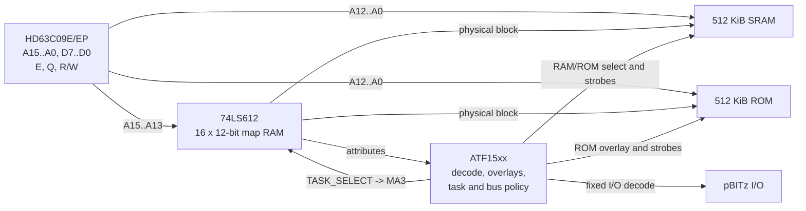

# Espresso-09 Architecture

**Status:** architectural baseline; schematic, CPLD fitter, and timing validation pending  
**Target CPU:** Hitachi HD63C09E / HD63C09EP  
**Primary OS:** NitrOS-9 Level 2  
**Physical memory:** 512 KiB RAM + 512 KiB ROM  
**Logical address space:** 64 KiB  
**DAT block size:** 8 KiB

## 1. Design goals

Espresso-09 is the 6309 member of the pBITz coffee-machine family. The machine is intended to feel like a capable late-8-bit system rather than a literal clone of an existing computer.

The current architectural goals are:

- exactly **512 KiB of RAM and 512 KiB of ROM** in a 20-bit physical address space
- a large, almost uninterrupted logical RAM workspace for the 6309 and GameOS-style allocators
- a permanent fixed I/O window that cannot disappear when the MMU task changes
- compatibility with the pBITz **4-bit Device Select** convention
- at least sixteen card-local register addresses per selected pBITz device
- hardware boot and interrupt vectors that are always reachable
- an instant-on NitrOS-9 image in ROM, followed by normal execution from RAM
- a memory-management design that fits NitrOS-9 Level 2 instead of reproducing a CoCo 3 GIME in a CPLD
- a conventional peripheral boundary between the host CPU and RX660 I/O Controller rather than a shared-memory transport

## 2. Architectural overview

The memory subsystem is divided between two devices with deliberately different jobs:

- the **74LS612** stores the actual translation entries and performs DAT translation
- an **ATF15xx CPLD** implements decode, task selection, boot/fixed overlays, mapper-register access, transfer qualification, and optional protection/fault policy

The CPLD is not a second MMU. In particular, Espresso-09 uses the LS612 `MA3` input as the hardware task selector.



## 3. NitrOS-9 Level 2 memory model

NitrOS-9 Level 2 already organizes a process address space as eight 8 KiB DAT blocks. Espresso-09 follows that model directly.

The LS612 contains sixteen mapping registers, so they are divided into two complete hardware maps:

```text
entries 0..7    task 0: permanent system/kernel map
entries 8..15   task 1: currently active user-process map
```

The map-address inputs are:

```text
MA0 = CPU A13
MA1 = CPU A14
MA2 = CPU A15
MA3 = TASK_SELECT
```

Therefore:

```text
TASK_SELECT = 0   -> entries 0..7
TASK_SELECT = 1   -> entries 8..15
```

CPU `A12..A0` bypass the mapper and form the offset within the selected 8 KiB block.

Additional NitrOS-9 process DAT images remain in kernel memory. A context switch to another process loads its eight physical-block bytes into LS612 entries 8..15. The task-0 system map normally remains resident.

This preserves the useful NitrOS-9 concepts:

- eight 8 KiB blocks per process
- eight-byte process DAT images
- an always-available system map
- one active user map in hardware
- software storage of additional process maps
- existing `F$MapBlk`, `F$Move`, module-sharing, and process-memory concepts

No CoCo-compatible GIME peripheral behavior is implied or required.

## 4. Logical address space

The current baseline keeps the DAT-translated region contiguous until the last 512 bytes of the CPU address space.

| Logical range | Size | Function | Task-dependent? |
| --- | ---: | --- | --- |
| `0000h-FDFFh` | 63.5 KiB | DAT-translated memory | Yes |
| `FE00h-FEFFh` | 256 B | Fixed pBITz I/O | No |
| `FF00h-FF1Fh` | 32 B | Fixed MMU/control registers | No |
| `FF20h-FFEFh` | 208 B | Fixed common RAM / task-switch code | No |
| `FFF0h-FFFFh` | 16 B | Fixed vector window | No |

The fixed ranges are CPLD overlays on top of the otherwise normal logical block 7 translation.

The exact physical backing of the common/vector RAM remains an implementation detail. A reserved region of main SRAM is the current assumption; the hardware design must ensure that it cannot be accidentally allocated as ordinary process memory.

### 4.1 Why the fixed region is at the top

Putting fixed I/O and common state at the top leaves the CPU with one large unbroken translated workspace from `0000h` through `FDFFh`.

This is useful for:

- 6309 `TFM` operations
- simple linear allocators
- large contiguous process address spaces
- avoiding an I/O hole in the middle of normal RAM

## 5. pBITz I/O window

The `FE00h-FEFFh` range is permanently visible and independent of the current LS612 task.

Its low byte is divided as:

```text
A7..A4   Device Select 0..15
A3..A0   card-local register 0..15
```

Conceptually:

```text
FE D R
   | |
   | +-- local register
   +---- pBITz Device Select
```

A card may compare `A7..A4` against its 4-bit rotary-switch setting and then use `A3..A0` for its own sub-decoding. This lets devices such as a VIA, ESCC, latch, FIFO, or other peripheral decode their own internal registers without changing the pBITz bus convention.

The fixed window must never depend on LS612 contents or `TASK_SELECT`.

The selected host interface for the RX660 I/O Controller is a **W65C22S VIA**. Its sixteen host-visible registers fit naturally into one pBITz Device Select slot. The exact Device Select value is not yet frozen.

## 6. Physical memory map

Espresso-09 has a 20-bit physical address space:

```text
00000h-7FFFFh   512 KiB RAM
80000h-FFFFFh   512 KiB ROM
```

With 8 KiB blocks:

```text
1 MiB / 8 KiB = 128 physical blocks
```

so a translated block number needs seven bits.

Recommended block numbering is:

```text
00h-3Fh   RAM blocks
40h-7Fh   ROM blocks
```

The high physical block bit therefore naturally selects the memory half:

```text
B6 = 0   RAM
B6 = 1   ROM
```

A logical address is translated as:

```text
physical_address = (physical_block << 13) | logical_address[12:0]
```

### Example

If logical block 5 maps physical block `23h`:

```text
logical address:   BABC
block offset:      1ABC
physical block:    23
physical address:  47ABC
```

If the same logical block maps physical block `63h`, it addresses the corresponding ROM half instead.

## 7. LS612 entry format

Each LS612 mapping register stores twelve bits.

Only seven bits are required for the physical block number, leaving **five bits of per-entry metadata**:

```text
+----------------------+-------------------------+
| 5 attribute bits     | 7-bit physical block    |
+----------------------+-------------------------+
```

The physical-block output wiring should preserve a useful pass-mode identity map. A recommended arrangement is:

| LS612 output | Physical address | Meaning |
| --- | --- | --- |
| `MO8` | `PA13` | block bit B0 |
| `MO9` | `PA14` | block bit B1 |
| `MO10` | `PA15` | block bit B2 |
| `MO4` | `PA16` | block bit B3 |
| `MO5` | `PA17` | block bit B4 |
| `MO6` | `PA18` | block bit B5 |
| `MO7` | `PA19` | block bit B6 / RAM-ROM half |
| `MO0..MO3`, `MO11` | CPLD | five attribute bits |

The exact mapper register-data wiring from the 8-bit CPU bus is not yet frozen. The design requirement is that an ordinary NitrOS-9 DAT write remain a **single byte containing the physical block number**, while the CPLD supplies/stages any Espresso-specific attribute bits.

Because only seven physical block bits are valid, software DAT values `80h-FFh` are invalid in the 1 MiB configuration and should be rejected or faulted rather than aliased.

## 8. Per-entry attributes

Five attribute bits are available, but not all need to be committed immediately.

A useful initial policy is:

| Attribute | Purpose |
| --- | --- |
| `WRITE_PROTECT` | suppress writes to the mapped block |
| `SYSTEM_ONLY` | deny access while task 1 is active |
| `INVALID` | mark the entry unmapped and fault accesses |
| reserved | future debug/watch/shared-memory use |
| reserved | future use |

Attribute value zero should mean a normal valid writable mapping.

Attributes are an Espresso-specific extension. NitrOS-9 process DAT images should remain eight ordinary block-number bytes.

### 8.1 Attribute staging

The preferred programming model is a one-shot CPLD staging register:

1. ordinary mapper writes use default attributes
2. software may write an explicit attribute value to `MMU_ATTR`
3. the next mapper-entry write stores those attributes with the block number
4. the pending attribute override then clears

This keeps normal NitrOS-9 DAT loading simple while allowing protected, invalid, or diagnostic mappings where explicitly requested.

## 9. Fixed MMU/control interface

The proposed fixed control block is `FF00h-FF1Fh`.

A practical register layout is:

| Offset | Function |
| ---: | --- |
| `00h-07h` | task-0 LS612 entries |
| `08h-0Fh` | task-1 LS612 entries |
| `10h` | `MMU_ATTR` staging register |
| `11h` | `MMU_CTRL` / task and boot controls |
| `12h` | fault/status |
| `13h` | faulting logical block / active task |
| `14h` | attribute readback |
| `15h-1Fh` | reserved |

The LS612 register-select inputs can be wired directly from CPU `A0..A3` for the sixteen mapper entries.

Mapper-register cycles must suppress normal RAM, ROM, and pBITz transfer strobes because mapper outputs are not meaningful as normal memory addresses during register access.

Writes to MMU control state while task 1 is active should be blocked in hardware. Normal task changes therefore occur through fixed common task-switch code entered under system control.

## 10. Reset and boot mapping

The LS612 mapping RAM has no guaranteed useful power-up contents. Espresso-09 must therefore not depend on map-register state at reset.

### 10.1 Reset defaults

Reset should force:

```text
LS612 pass mode
TASK_SELECT = 0
mapper register interface inactive
memory write strobes inactive
boot ROM overlay enabled
```

The pass-mode wiring is chosen so the untranslated CPU address appears as the first 64 KiB of physical RAM:

```text
logical 0000h-FFFFh -> physical RAM 00000h-0FFFFh
```

The CPLD then overlays boot ROM and fixed regions at the top of the logical address space.

A practical reset view is:

```text
0000h-DFFFh   identity-mapped RAM
E000h-FDFFh   boot ROM overlay
FE00h-FEFFh   fixed pBITz I/O
FF00h-FF1Fh   fixed MMU/control
FF20h-FFFFh   boot ROM/common/vector overlay
```

The final boot-ROM split may move slightly during CPLD fitting, but the reset vector at `FFFEh-FFFFh` must always come from ROM while reset/boot mode is active.

The boot overlay can use the final physical ROM block (`7Fh`) as the bootstrap block, placing the reset vectors at the natural end of physical ROM.

### 10.2 Hardware-safe reset behavior

The board should establish safe mapper and memory states even before the CPLD image is fully active:

- pull LS612 mode toward pass mode
- keep LS612 register `CS` and `STROBE` inactive
- force `MA3`/task select low
- keep RAM and ROM write strobes inactive through hardware-safe defaults
- do not rely on uninitialized CPLD outputs to prevent accidental memory writes

## 11. ROM shadowing and instant-on NitrOS-9

The ROM is intended to contain an immediately bootable Espresso system image, including the NitrOS-9 components needed for startup.

Normal runtime execution should occur from RAM.

A baseline cold-start sequence is:

1. **Reset in pass mode.** Task 0 is selected and the boot overlay supplies the reset vector.
2. **Enter the bootstrap.** Establish a stack in known RAM and keep interrupts masked.
3. **Initialize LS612 task 0.** Create a safe initial system DAT while boot ROM remains overlaid.
4. **Initialize LS612 task 1.** Start with a known user map or invalid entries as appropriate.
5. **Enter map mode.** The bootstrap is still executing from the fixed ROM overlay, so changing the translated lower memory cannot remove the current instruction stream.
6. **Shadow ROM to RAM.** Use two temporary 8 KiB task-0 windows: one mapped to a ROM block and one to the corresponding RAM block. Copy with `TFM` and repeat for the ROM image.
7. **Install the runtime system map.** Point the task-0 DAT at the RAM-resident NitrOS-9 image and initialize common/vector RAM.
8. **Move the bootstrap stack if necessary.** The block containing the active stack must never be overwritten while it is in use; a full 512 KiB shadow copy must handle the bootstrap/common block last or relocate the stack first.
9. **Prepare a RAM-resident handoff stub.** The instruction that disables the boot overlay must not be followed by an instruction that existed only in the disappearing ROM window.
10. **Jump to the RAM stub and disable the boot ROM overlay.** Fixed I/O, MMU/control, common RAM, and vectors remain visible.
11. **Enter NitrOS-9 cold start from RAM.** Normal mappings now use RAM.

For a simple one-to-one full shadow, the physical copy pairing is naturally:

```text
ROM block 40h -> RAM block 00h
ROM block 41h -> RAM block 01h
...
ROM block 7Fh -> RAM block 3Fh
```

Copying the complete ROM does not mean every RAM block must remain permanently occupied. Once NitrOS-9 is running, blocks containing no live kernel/module data can be treated as free and overwritten normally.

The architecture also permits a future optimized boot that copies only populated/live ROM blocks; the full-shadow sequence is the simple baseline.

## 12. Runtime vector and common area

The top 256 bytes are divided between control, common code, and vectors so that task changes cannot remove the code needed to perform the change itself.

`FF20h-FFEFh` is intended for small fixed routines and state such as:

- task-switch trampolines
- interrupt/system-call entry and return glue
- temporary task state
- code that must execute while `MA3` changes

`FFF0h-FFFFh` contains the fixed hardware vector window.

At reset, the vector window is supplied by ROM. Before the boot overlay is removed, bootstrap code must initialize the runtime vector backing in fixed common RAM. After handoff, interrupt and software-interrupt vectors therefore remain independent of the selected DAT task.

The baseline design favors explicit task switching in the common trampoline rather than requiring the CPLD to automatically emulate GIME task-switch behavior during every interrupt acknowledge. Use of `BA`/`BS` for additional validation or diagnostics remains an implementation option, not an architectural requirement.

## 13. Context switching

A normal process switch leaves task 0 intact and updates task 1:

```text
load 8 physical-block bytes into entries 8..15
select task 1 through the fixed trampoline
```

System calls and interrupts enter through fixed vector/common code, switch to task 0 under kernel control, and move to a known system stack before performing substantial work.

Return to a user process is the reverse operation and must occur through fixed common code so the instruction stream survives the `MA3` transition.

This is intentionally simpler than building a second translation mechanism in the CPLD.

## 14. Protection and fault behavior

If protection attributes are implemented, denied accesses must never create side effects.

For a translated cycle, policy can be summarized as:

```text
allowed =
    not INVALID
    AND (not SYSTEM_ONLY OR TASK_SELECT == 0)
    AND (read_cycle OR not WRITE_PROTECT)
```

On a denied access the CPLD should:

- suppress RAM, ROM, and MMIO transfer strobes
- never assert memory write-enable
- latch the active task and logical block
- latch read/write and protection cause
- optionally assert `FIRQ`

The 6309 has no restartable bus-fault mechanism. Protection is therefore useful for containment and diagnostics, not demand paging or transparent recovery.

## 15. CPLD responsibilities

The ATF15xx should remain a control/decode device rather than becoming the memory mapper itself.

Its expected responsibilities are:

- reset and boot-overlay state
- LS612 pass/map control
- `TASK_SELECT` generation for LS612 `MA3`
- LS612 register `CS` and `STROBE`
- fixed `FE00h` pBITz I/O decode
- fixed MMU/control/common/vector overlays
- RAM/ROM chip selection
- safe `/OE` and `/WE` qualification
- mapper attribute staging/readback if implemented
- protection/fault capture if implemented
- blocking user-task writes to privileged MMU state
- JTAG-safe defaults

The exact ATF1502/ATF1504 package is not yet frozen. Pin count and fitted routing should be validated before schematic commitment; a larger package is preferable to squeezing architectural functions out merely to fit a 44-pin device.

## 16. Memory and peripheral timing

The LS612 adds translation delay before the physical high address bits are valid. The earlier design work estimated approximately 70 ns maximum map-address-to-map-output delay for the LS612, before memory and CPLD policy delay are included.

This remains a **preliminary budget**, not a timing proof.

The final analysis must include:

- HD63C09E address-valid and data setup/hold timing
- `E`/`Q` phase relationships
- LS612 map and register timing
- fitted CPLD propagation delay
- RAM and ROM `tAA`, `tCE`, `tOE`, and write timing
- mapper output loading and any buffering
- voltage and temperature margin

Every side-effecting transfer must be qualified only after translation/decode is stable:

- RAM write-enable
- memory output-enable where appropriate
- MMIO read strobes
- MMIO write strobes
- peripheral selects whose assertion has side effects

Do not derive memory write-enable directly from CPU `R/W`.

For 6800-family peripherals, provide stable predecode and use the valid `E` phase as the actual transfer strobe as required by the device.

## 17. Electrical considerations

The original SN74LS612 is a TTL device with significant supply current. Memory and CPLD inputs driven by it must accept the mapper's guaranteed logic-high level.

The hardware design should therefore verify:

- TTL-compatible input thresholds on SRAM, ROM, and CPLD
- any required HCT buffering
- local 100 nF decoupling at the mapper
- local bulk capacitance near mapper and memory
- 5 V regulator and connector current margin
- mapper temperature under worst-case load

A 74HCT612-compatible part may be attractive if a trustworthy source is found, but obsolete/NOS provenance, electrical limits, and timing must be validated against the actual device used.

## 18. W65C22S / RX660 I/O Controller

Espresso-09 uses an **RX660-based I/O Controller** for modern peripheral services. The selected host-facing transport is a **W65C22S VIA** rather than dual-port RAM.

The architectural boundary is intentionally conventional:

```text
6309 host bus
    |
    v
W65C22S VIA
    |
    | 8-bit parallel data/control + handshake
    v
RX660
    |
    +-- software register file
    +-- command/reply queues
    +-- transfer buffers
    +-- asynchronous events
```

The host sees an ordinary peripheral, not another memory subsystem. The VIA occupies one 16-register pBITz Device Select slot in the fixed `FE00h-FEFFh` aperture. The exact Device Select value remains a board-level decision.

The VIA is a transport endpoint rather than the complete IOC register file. Logical IOC registers and state live in RX660 SRAM. Firmware may therefore expose a substantially larger software-defined register/command space without consuming additional 6309 address space.

A likely electrical model uses:

- one VIA 8-bit port as the bidirectional byte data path
- the second 8-bit port for command, register index, or transaction control
- VIA control lines for host-to-RX660 strobe/acknowledge and RX660-to-host ready/event signaling

The exact PA/PB and CA/CB assignment is intentionally not frozen yet. It should be selected after reviewing the VIA handshake modes and RX660 GPIO/interrupt placement.

### 18.1 IOCALL transport model

The byte-level protocol should support four basic operations:

- host-to-IOC command submission
- IOC-to-host replies
- asynchronous IOC events with host interrupt notification
- bulk byte-stream transfers

A logical register access can be represented as an indexed transaction, for example:

```text
WRITE IOC register 12h = FAh

host -> VIA: index 12h
host -> VIA: data FAh
host -> VIA: strobe
RX660:      ioc_register[12h] = FAh
```

These logical registers are software constructs in RX660 memory, not physical VIA registers.

Bulk transfers use the same byte path. For example, a storage read can prepare a sector in RX660 SRAM and stream it through the VIA after a command/reply exchange. This avoids a CPU-visible shared-memory buffer and avoids SRAM arbitration while still allowing the RX660 to absorb data into its much larger local memory.

The intended software abstraction is therefore:

```text
IOCALL ABI
    |
    v
W65C22S transport
    |
    v
RX660 command/register/buffer model
```

This also leaves room for other coffee-series machines to use the same IOCALL command ABI even if their electrical transport differs.

### 18.2 Interrupts and timers

The VIA provides the host-visible interrupt and handshake mechanism for IOC events. The exact event encoding and interrupt service protocol remain to be defined.

The VIA's timers and shift register are available to Espresso-09, but they do not have to be used merely because the device provides them. The final source of the NitrOS-9 system tick and other host timing services remains an implementation decision; it may use a VIA timer, an RX660-generated event, or another system timer if one is later added.

The design is **not** intended to grow a second shared-memory path to the RX660 alongside the VIA. If a future high-bandwidth subsystem genuinely needs shared memory or DMA, it should be designed as a separate facility with explicit physical-address semantics rather than being folded into the IOC transport.

## 19. Verification plan

### 19.1 Mapper and CPLD simulation

Verify:

- pass-mode identity mapping with task forced to zero
- all eight task-0 entries
- all eight task-1 entries
- `MA3` task switching without changing the 8 KiB offset
- physical block `00h-3Fh` selecting RAM
- physical block `40h-7Fh` selecting ROM
- invalid handling for block values `80h-FFh`
- fixed `FE00h-FEFFh` visibility in both tasks
- fixed MMU/control/common/vector visibility in both tasks
- mapper-register cycles suppressing memory/MMIO strobes
- attribute defaults and one-shot override, if implemented
- write-protected/system-only/invalid entries, if implemented
- reset/JTAG-safe write inhibition

### 19.2 Boot validation

Verify:

- reset vector always comes from ROM
- mapper contents may be arbitrary at power-up without affecting boot
- pass-mode RAM is usable before DAT initialization
- switching to map mode cannot remove executing bootstrap code
- each ROM block can be copied to its RAM partner through temporary windows
- bootstrap stack is never overwritten by the shadow copy
- runtime vectors are initialized before ROM overlay removal
- handoff instruction stream is entirely in RAM when ROM disappears
- reset always restores the ROM boot view

### 19.3 NitrOS-9 validation

Verify:

- eight-byte DAT-image loading into task 1
- permanent task-0 system map
- process creation and process switching
- system call entry through fixed common/vector code
- IRQ/FIRQ entry from task 1
- return to task 1
- `F$MapBlk`, `F$Move`, and module sharing
- correct physical-memory sizing to 64 RAM blocks
- user attempts to modify privileged MMU registers are rejected

### 19.4 I/O Controller validation

Verify:

- all sixteen VIA registers are accessible through the selected fixed pBITz Device Select slot
- VIA access remains visible in both LS612 tasks
- host-to-RX660 byte handshaking cannot lose or duplicate bytes
- RX660-to-host replies cannot race host reads
- asynchronous events reliably assert and clear the host interrupt
- command/reply transactions recover cleanly from reset or partial transfers
- bulk transfers can stream blocks without requiring shared host memory
- IOC protocol state remains entirely RX660-owned except for the VIA transport state

### 19.5 Hardware timing validation

Measure:

- logical block/task transition to stable LS612 outputs
- mapper output to valid RAM/ROM selects
- address transition to safe `/OE` and `/WE`
- absence of read-sensitive MMIO glitches
- mapper `STROBE` setup/hold and pulse width
- RAM/ROM data validity at CPU sampling
- task-switch timing through the common trampoline
- W65C22S bus timing relative to the selected 6309 `E` clock
- VIA/RX660 handshake latency and setup/hold margins
- 5 V rail droop and mapper temperature
- behavior during CPLD JTAG programming

## 20. Open implementation decisions

The following details are intentionally not yet frozen:

- exact ATF15xx device and package
- exact LS612 register-data pin permutation for seven block bits plus five attributes
- exact attribute encodings beyond the initial proposed functions
- physical reservation/backing for the fixed common/vector RAM
- final boot-ROM overlay boundaries after CPLD fitting
- exact RAM and ROM devices
- LS612 versus a validated compatible HCT mapper
- final 6309 clock and complete timing proof
- W65C22S Device Select assignment
- exact VIA PA/PB and CA/CB assignment to the RX660
- byte-level IOCALL command/reply/event/bulk-transfer protocol
- final timer source for the NitrOS-9 system tick

These items should be resolved by schematic and firmware bring-up without changing the central architectural decisions: **two native 8 KiB LS612 maps selected by `MA3`, a small fixed top-of-memory system area, and a W65C22S peripheral transport to the RX660 I/O Controller.**

## 21. References

- Texas Instruments, **SN54LS610 through SN54LS613 / SN74LS610 through SN74LS613 Memory Mappers**:  
  <https://media.digikey.com/pdf/Data%20Sheets/Rochester%20PDFs/SN54LSS61x_SN74LS61x.pdf>
- Hitachi, **HD6309/HD63C09 Hardware Data Sheet**
- Western Design Center, **W65C22S Versatile Interface Adapter**
- Microchip, **ATF1502AS/ATF1502ASL 5V CPLD Data Sheet**
- Microchip, **ATF1504AS 5V CPLD Data Sheet**
- [NitrOS-9 source tree](https://github.com/nitros9project/nitros9)
- [pBITzPlatform](https://github.com/dumaiss/pBITzPlatform)
