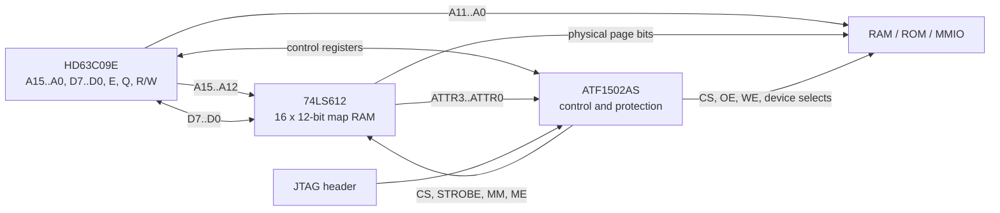

# Espresso-09 Memory Architecture: 74LS612 Mapper + ATF1502AS Control CPLD

**Status:** Proposed architecture  
**Target CPU:** Hitachi HD63C09E / compatible 6809-family CPU  
**Baseline physical RAM:** 1 MiB  
**Logical address space:** 64 KiB  
**Page size:** 4 KiB  
**Revision:** 2026-07-02

## 1. Overview

The proposed Espresso-09 memory subsystem divides the MMU into two complementary parts:

- A **74LS612 memory mapper** stores the page-translation table and performs the address translation.
- An **ATF1502AS CPLD** implements policy and control: boot mapping, protection attributes, mapper-register access, memory/device selection, fault handling, and safe write qualification.

This avoids consuming most of a larger CPLD as a bank of mapping registers while retaining programmable protection and control logic.

The baseline design maps sixteen 4 KiB logical pages into a 1 MiB physical address space. Four otherwise-unused bits in every 74LS612 mapping entry are treated as per-page attributes.



## 2. Design goals

- Expand the 6309's 64 KiB logical space without coarse whole-bank switching.
- Use sixteen independently mapped 4 KiB pages.
- Provide a deterministic reset and boot map despite the volatile 74LS612 map RAM.
- Attach protection and validity information to each mapped page.
- Prevent unsafe memory writes while translated address and attribute outputs are settling.
- Keep the control logic field-upgradable through JTAG.
- Use ordinary Verilog-based development and simulation.
- Preserve a practical upgrade path from the ATF1502AS to the pin-compatible ATF1504AS if the fitter or pin budget becomes tight.

## 3. 74LS612 organisation

The 74LS612 contains:

- Sixteen 12-bit mapping registers.
- Four map-address inputs, `MA0..MA3`.
- Twelve map outputs, `MO0..MO11`.
- Four independent register-select inputs, `RS0..RS3`.
- A 12-bit register data interface, `D0..D11`.
- Map, pass, register-read, and register-write operating modes.
- Three-state map outputs.

During map mode, `MA0..MA3` select one of the sixteen registers and its 12-bit value appears on `MO0..MO11`.

During pass mode:

- `MA0..MA3` pass through to `MO8..MO11`.
- `MO0..MO7` are forced low.

The pass-mode behaviour is used to create a deterministic identity-mapped first 64 KiB during reset.

## 4. Logical and physical address format

The 6309 logical address is split into:

```text
A15..A12  logical page number: 0..15
A11..A0   4 KiB page offset
```

For the 1 MiB baseline, each 74LS612 entry is interpreted as:

```text
+--------------------------+----------------------+
| 8-bit physical page      | 4-bit attributes     |
| P7..P0                   | ATTR3..ATTR0          |
+--------------------------+----------------------+
```

The resulting physical address is:

```text
PA19..PA12 = physical page P7..P0
PA11..PA0  = CPU A11..A0
```

Therefore:

```text
physical_address = (physical_page << 12) | logical_address[11:0]
```

### Example

If logical page 5 contains physical page `0x23`:

```text
logical address:  0x5ABC
physical address: 0x23ABC
```

## 5. Recommended bit wiring

The wiring below makes an ordinary 8-bit CPU write represent the physical page number naturally while preserving identity mapping in 74LS612 pass mode.

### 5.1 Map-address path

| Source | Destination | Function |
|---|---|---|
| CPU `A12` | 74LS612 `MA0` | Logical page bit 0 |
| CPU `A13` | 74LS612 `MA1` | Logical page bit 1 |
| CPU `A14` | 74LS612 `MA2` | Logical page bit 2 |
| CPU `A15` | 74LS612 `MA3` | Logical page bit 3 |
| CPU `A11..A0` | Memory `A11..A0` | Offset inside 4 KiB page |

### 5.2 Physical-page outputs

| 74LS612 output | Physical address | Page-byte bit |
|---|---|---|
| `MO8` | `PA12` | `P0` |
| `MO9` | `PA13` | `P1` |
| `MO10` | `PA14` | `P2` |
| `MO11` | `PA15` | `P3` |
| `MO4` | `PA16` | `P4` |
| `MO5` | `PA17` | `P5` |
| `MO6` | `PA18` | `P6` |
| `MO7` | `PA19` | `P7` |
| `MO0..MO3` | ATF1502 inputs | `ATTR0..ATTR3` |

The physical page number can therefore be reconstructed as:

```text
P7..P0 = { MO7..MO4, MO11..MO8 }
```

### 5.3 Map-register data bus

| CPU data bit | 74LS612 register-data pin | Stored field |
|---|---|---|
| `D0` | `D8` | `P0` |
| `D1` | `D9` | `P1` |
| `D2` | `D10` | `P2` |
| `D3` | `D11` | `P3` |
| `D4` | `D4` | `P4` |
| `D5` | `D5` | `P5` |
| `D6` | `D6` | `P6` |
| `D7` | `D7` | `P7` |
| ATF1502 attribute driver | `D0..D3` | `ATTR0..ATTR3` |

The ATF1502 must three-state its attribute-driver pins whenever the 74LS612 is reading a register. This prevents contention when the mapper drives `D0..D3`.

## 6. Pass-mode boot map

The 74LS612's internal map RAM has no guaranteed useful power-up contents. The system must therefore reset in pass mode.

Recommended defaults:

```text
MM = 1   pass mode
ME = 0   map outputs enabled
CS = 1   mapper register interface inactive
STROBE = 1
```

With the proposed wiring, pass mode produces:

```text
MO8..MO11 = CPU A12..A15
MO4..MO7  = 0
MO0..MO3  = 0
```

This maps the CPU's first 64 KiB directly to physical addresses `0x00000..0x0FFFF`, with all page attributes cleared.

The ATF1502 overlays the boot ROM over the board's selected reset/vector region while leaving RAM beneath it available for later use.

Hardware pull resistors should establish safe inactive states while the CPLD is resetting or being programmed:

- Pull `MM` high for pass mode.
- Pull `ME` high if fail-safe high-impedance mapper outputs are preferred during CPLD reprogramming; the CPLD then actively drives it low during operation.
- Pull `CS` and `STROBE` high.
- Ensure memory `/WE` is pulled inactive independently of CPLD configuration.

## 7. Proposed per-page attributes

A useful initial interpretation is:

| Bit | Name | Meaning when set |
|---:|---|---|
| 0 | `WRITE_PROTECT` | Writes to the mapped page are blocked and faulted |
| 1 | `SUPERVISOR_ONLY` | User-mode accesses are blocked and faulted |
| 3..2 | `PAGE_TYPE` | Select RAM, ROM, MMIO, or invalid/fault |

Suggested `PAGE_TYPE` encoding:

| `ATTR3..ATTR2` | Page type |
|---|---|
| `00` | RAM |
| `01` | ROM |
| `10` | MMIO/device page |
| `11` | Invalid/unmapped |

This encoding is provisional. Routing all four attribute outputs to the CPLD allows the policy to be changed later without modifying the PCB.

### Physical-memory versus attribute trade-off

The mapper always provides twelve output bits. Bits not used for physical page addressing may be reused as attributes.

```text
physical page bits = log2(physical memory size / 4096)
attribute bits     = 12 - physical page bits
```

| Physical memory | Page bits | Available attributes |
|---:|---:|---:|
| 512 KiB | 7 | 5 |
| 1 MiB | 8 | 4 |
| 2 MiB | 9 | 3 |
| 4 MiB | 10 | 2 |
| 8 MiB | 11 | 1 |
| 16 MiB | 12 | 0 |

The wiring in this document is specifically optimised for **1 MiB plus four attributes**.

## 8. Mapper programming interface

The ATF1502 exposes a small memory-mapped control block. Exact addresses remain a board-level decision.

Suggested registers:

| Register | Access | Purpose |
|---|---|---|
| `MMU_CTRL` | R/W | Map enable, boot-overlay control, fault enables |
| `MMU_ATTR` | R/W | Staging latch for the next mapper write |
| `MMU_MAP[0..15]` | R/W | Physical page byte for each logical page |
| `MMU_FAULT_STATUS` | R/W1C | Cause of the most recent protection fault |
| `MMU_FAULT_PAGE` | R | Logical page involved in the fault |
| `MMU_ATTR_READ` | R | Optional readback of the selected entry's attributes |

### 8.1 Register selection

The simplest mapping is:

```text
RS0..RS3 = CPU A0..A3
```

A sixteen-byte window then directly selects the sixteen 74LS612 entries.

### 8.2 Writing an entry

Software first writes the desired attribute nibble, then writes the physical page byte:

```text
write MMU_ATTR, attributes
write MMU_MAP[index], physical_page
```

During the second write:

- CPU `D7..D0` drive the physical page field through the permuted connections.
- The ATF1502 drives the staged attributes onto 74LS612 `D3..D0`.
- The CPLD asserts mapper `CS`.
- The CPLD sets mapper `R/W` low.
- The CPLD generates a valid low pulse on `STROBE`.

All twelve bits are stored in the selected 74LS612 entry simultaneously.

### 8.3 Reading an entry

During a mapper-register read:

- The 74LS612 drives the page byte back onto CPU `D7..D0`.
- It also drives the attribute nibble toward the ATF1502.
- The ATF1502 attribute-driver pins must be high impedance.
- Attribute readback may be exposed through a separate CPLD register if useful for diagnostics.

### 8.4 Mapper-register cycles must not access memory

When `CS` is low for a mapper-register read or write, the CPLD must suppress RAM, ROM, and normal MMIO selects. Mapper outputs may change or become irrelevant during these accesses.

## 9. ATF1502 responsibilities

The ATF1502 should implement:

- Reset-state and boot-overlay control.
- Mapper pass/map mode control.
- Mapper-register address decode.
- Mapper `CS`, `R/W`, and `STROBE` generation.
- Four-bit attribute staging latch.
- Three-state control for mapper attribute-data pins.
- Per-page access-policy evaluation.
- RAM, ROM, and MMIO chip selects.
- Safe SRAM `/OE` and `/WE` qualification.
- Fault status and logical-page capture.
- Optional fault interrupt output.
- A privilege-state latch if hardware-enforced protection is required.
- JTAG in-system programming.

A 32-macrocell ATF1502 is a reasonable target because the translation table itself remains in the 74LS612. The complete pin assignment and Verilog design must still be run through the fitter early. The 44-pin ATF1502AS and ATF1504AS footprint can be shared, providing a low-risk move to 64 macrocells if protection logic or pin routing exceeds the 1502.

## 10. Protection and privilege model

### 10.1 Access checks

For every mapped memory cycle, the CPLD evaluates:

```text
allowed =
    page_is_valid
    AND (not supervisor_only OR supervisor_mode)
    AND (read_cycle OR not write_protect)
```

If the access is not allowed:

- Do not assert RAM, ROM, or MMIO chip select.
- Never assert memory `/WE`.
- Latch the fault cause and logical page.
- Optionally assert `FIRQ`, `IRQ`, or `NMI`.

### 10.2 6309 privilege caveat

The 6309 does not expose a hardware supervisor/user signal. A `SUPERVISOR_ONLY` attribute provides real enforcement only if the privilege latch has a transition mechanism that user code cannot spoof.

One workable model is:

1. Reset and selected hardware traps force `SUPERVISOR_MODE = 1`.
2. The kernel performs a one-way write to enter user mode.
3. User mode cannot write MMU control registers or restore supervisor mode.
4. A hardware-generated interrupt or trap clears user mode and enters the kernel.
5. User-to-kernel calls use a CPLD doorbell/trap that generates the selected interrupt.

A software `SWI` instruction alone does not provide an external signal to the CPLD. If GameOS continues to use `SWI`/`SWI2` for services without an additional hardware transition, page protection should be regarded primarily as bug containment rather than a secure privilege boundary.

## 11. Safe memory timing

### 11.1 Translation path

The SN74LS612 data sheet specifies a maximum map-address-to-map-output access time of approximately **70 ns** under its stated 25 °C switching test conditions.

With 15 ns SRAM:

```text
mapper address path = 70 ns
SRAM address access = 15 ns
--------------------------------
estimated data path = 85 ns
```

If RAM chip select depends on attributes passing through a 7.5 ns CPLD path:

```text
mapper attribute path = 70 ns
CPLD policy path       = 7.5 ns
SRAM chip-enable path  = 15 ns
--------------------------------
estimated CE path      = 92.5 ns
```

These are preliminary path estimates, not a completed timing proof. The final design must include:

- HD63C09E address-valid timing.
- `E` and `Q` phase relationships.
- CPU data setup and hold times.
- CPLD speed grade and fitted path delay.
- 74LS612 loading and board capacitance.
- SRAM `tAA`, `tCE`, `tOE`, and write timing.
- Temperature and voltage margins.

### 11.2 Write safety

Do not derive SRAM `/WE` directly from CPU `R/W`.

The translated address and attribute outputs can remain invalid for tens of nanoseconds after the CPU changes `A15..A12`. The CPLD must assert `/WE` only in a bus phase where:

- Logical address is stable.
- 74LS612 map outputs are stable.
- Attributes have propagated through the CPLD.
- SRAM chip select is valid.
- CPU write data is valid.

A conservative design may delay write assertion within the valid `E` phase or generate it from a registered/phase-qualified CPLD term.

### 11.3 Mapper-register write timing

The 74LS612 requires, under its published operating conditions:

- A minimum 75 ns low `STROBE` pulse.
- Address, control, and data setup/hold requirements around the end of the strobe.

A 3 MHz 6309 bus should provide enough raw cycle time, but `STROBE` generation must be checked against the actual `E/Q` and write-data timing rather than inferred only from the nominal 333 ns cycle period.

## 12. Electrical considerations

### 12.1 TTL-level compatibility

The 74LS612 provides TTL-level outputs. Any SRAM, ROM, or CPLD input driven by its map outputs must accept a TTL high level; do not assume every 5 V CMOS memory has a sufficiently low `VIH`.

Preferred options:

- Select memories with explicitly TTL-compatible inputs.
- Add an HCT-family buffer if level compatibility is uncertain.
- Include the buffer's propagation delay in the timing analysis.

### 12.2 Power consumption

The 74LS612 is a relatively power-hungry bipolar device. Its data sheet lists supply current as high as approximately 230 mA in some output states.

Budget close to 1 W for the mapper alone in the worst case:

```text
P = V x I
P = 5 V x 0.230 A
P = 1.15 W
```

Board recommendations:

- Place at least one 100 nF ceramic capacitor directly at the device.
- Add local bulk capacitance near the mapper and RAM.
- Use low-impedance 5 V and ground planes.
- Include the mapper in regulator, connector, and thermal calculations.

### 12.3 Safe defaults during JTAG programming

During CPLD reprogramming:

- Hold the CPU in reset.
- Keep memory `/WE` inactive using a hardware pull resistor.
- Keep the 74LS612 register `CS` and `STROBE` inactive.
- Prefer a pull-up on `ME` so mapper outputs become high impedance if CPLD control disappears.
- Do not rely solely on the current CPLD image to prevent writes while that image is being replaced.

## 13. Boot sequence

A recommended firmware sequence is:

1. Reset with the 74LS612 in pass mode.
2. Execute from the CPLD-controlled boot ROM overlay.
3. Initialise the attribute staging register.
4. Write all sixteen mapper entries.
5. Initialise fault and privilege state.
6. Ensure the currently executing page, stack page, and vector page have valid mappings.
7. Enable map mode.
8. Verify execution in the translated map.
9. Disable or relocate the boot ROM overlay when desired.

Map mode must not be enabled until the page containing the next instruction is valid under the new translation table.

## 14. Context switching

A single 74LS612 contains one active set of sixteen mappings. It does not provide the GIME's dual hardware task maps.

For GameOS this may be sufficient. For a multitasking OS, a context switch can save and rewrite the sixteen entries. The cost should be measured before adding more hardware.

Possible later extensions:

- A second 74LS612 for two instantly selectable contexts.
- A shadow table in kernel RAM with an optimised mapper-load routine.
- A DMA or MCU-assisted mapper reload.
- An ATF1504 upgrade for more fault, lock, or context-control state.

## 15. Bus-master and DMA considerations

The proposed mapper translates CPU accesses only.

Any future bus master must use one of these models:

- Generate physical addresses directly and bypass the mapper.
- Drive the 74LS612 `MA` inputs while the CPU bus is relinquished.
- Use a separate translation context.
- Restrict DMA to a fixed common physical region.

This decision should be made before adding DMA-capable peripherals.

## 16. Verification plan

### Logic simulation

Create testbenches for:

- Pass-mode identity mapping.
- All sixteen map entries.
- Page-byte permutation.
- Attribute staging and simultaneous 12-bit writes.
- RAM, ROM, MMIO, and invalid page types.
- User/supervisor access combinations.
- Write-protected pages.
- Fault latching and clearing.
- Mapper-register readback.
- JTAG/reset-safe output defaults.

### Hardware validation

Measure:

- `MA` transition to stable `MO`.
- `MO`/attribute transition to RAM `/CS`.
- CPU address transition to safe `/WE`.
- Mapper `STROBE` width and setup/hold margins.
- SRAM read-data validity relative to CPU sampling.
- 5 V rail droop and mapper temperature.
- Behaviour while programming the CPLD through JTAG.

## 17. Open decisions

- Final installed RAM size.
- Final attribute encoding.
- Boot ROM location and overlay size.
- Exact MMU register addresses.
- Fault vector: `IRQ`, `FIRQ`, or `NMI`.
- Hardware mechanism for user-to-supervisor transitions.
- Whether mapper-register readback is required.
- Whether page 15/vector space receives an additional hardware lock.
- Whether the ATF1502 pin budget fits without external decode or buffering.
- Exact SRAM part and confirmation of TTL-compatible inputs.
- Final 6309 timing proof and `/WE` phase.

## 18. Sources

- Texas Instruments, **SN54LS610 through SN54LS613 / SN74LS610 through SN74LS613 Memory Mappers**:  
  <https://media.digikey.com/pdf/Data%20Sheets/Rochester%20PDFs/SN54LSS61x_SN74LS61x.pdf>

- Microchip, **ATF1502AS/ATF1502ASL 5V 32-Macrocell CPLD Data Sheet**:  
  <https://ww1.microchip.com/downloads/aemDocuments/documents/MPD/ProductDocuments/DataSheets/ATF1502AS-ATF1502ASL-5V-32-Macrocell-CPLD-Data-Sheet-20006619A.pdf>
