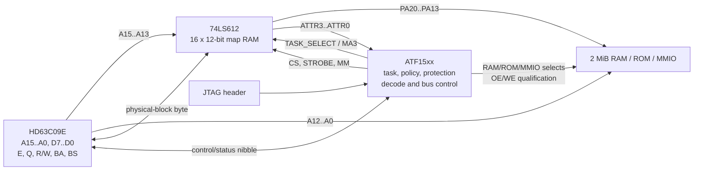

# Espresso-09 Memory Architecture: 74LS612 Mapper + ATF15xx Control CPLD

**Status:** Architecture locked; pinout, timing, and fitter validation pending  
**Target CPU:** Hitachi HD63C09E / compatible 6809-family CPU  
**Baseline physical RAM:** 2 MiB  
**Logical address space:** 64 KiB  
**Logical block size:** 8 KiB  
**Hardware maps:** Two sets of eight entries: system task and current user task  
**Revision:** 2026-07-02, revision 4

## 1. Overview

The Espresso-09 memory subsystem divides the MMU into two complementary parts:

- A **74LS612 memory mapper** stores sixteen 12-bit translation entries and performs physical-address translation.
- An **ATF15xx CPLD** implements policy and control: task selection, boot mapping, protection attributes, mapper-register access, fixed/common overlays, memory/device selection, fault handling, and safe bus qualification.

The sixteen mapper entries are organised as two hardware task maps:

```text
entries 0..7    task 0: permanent system map
entries 8..15   task 1: currently active user-process map
```

Each task maps eight 8 KiB logical blocks into a 2 MiB physical address space. Each entry stores:

```text
8-bit physical block number
4-bit protection/validity attribute nibble
```

This organisation deliberately matches the NitrOS-9 Level 2 memory model:

- Eight 8 KiB DAT blocks per process address space.
- A permanent system map and one active user map.
- Software DAT images for additional processes.
- Physical memory managed in 8 KiB blocks.
- A maximum of 256 physical blocks, or 2 MiB.

The architecture does **not** attempt to reproduce unrelated CoCo or GIME peripherals.



## 2. Locked architectural decisions

The following decisions are now part of the Espresso-09 architecture:

- NitrOS-9 Level 2 is the primary operating system target.
- The MMU uses **8 KiB logical blocks**, not 4 KiB pages.
- The mapper provides **two hardware task maps**:
  - task 0 for the kernel/system
  - task 1 for the current user process
- Physical RAM is **2 MiB**, organised as 256 physical 8 KiB blocks.
- Every mapper entry retains **four attribute bits**.
- NitrOS-9 process DAT images remain eight physical-block bytes; attributes are an Espresso-specific hardware extension.
- The mapper's task-select input is independent of the physical-block and attribute bits.
- Reset uses 74LS612 pass mode to expose the first 64 KiB of physical RAM as an identity map.
- A small fixed/common RAM window and fixed vector/control overlay are provided outside normal task translation.
- All side-effecting memory and MMIO strobes are qualified until mapper outputs have settled.
- CPLD JTAG remains permanently available.

Implementation choices that remain open include the exact CPLD package, fixed-window addresses, and final SRAM part.

## 3. NitrOS-9 compatibility model

### 3.1 Hardware tasks versus NitrOS-9 software tasks

NitrOS-9 may allocate many software task numbers, but it does not require every process map to exist simultaneously in hardware.

The expected model is:

```text
task 0 hardware map = system DAT image
task 1 hardware map = DAT image of the currently running process
```

Additional process DAT images remain in kernel memory. When a process becomes current, the kernel copies its eight-byte DAT image into task-1 mapper entries 8..15.

This preserves the existing Level 2 concepts:

- Eight DAT blocks per process.
- Eight-byte process DAT images.
- 8 KiB physical-memory allocation.
- System/user task switching.
- Software allocation of process task numbers.
- Existing module, process, and physical-memory management.

### 3.2 Expected porting boundary

The Espresso-09 port should require platform-specific equivalents of:

- Hardware definitions and MMU register addresses.
- Boot and relocation modules.
- Mapper initialisation.
- The routine that writes an eight-byte DAT image into hardware.
- System-task/user-task switching.
- Fixed/common-page and vector setup.
- Interrupt and clock drivers.
- Console, storage, and device drivers.
- Device descriptors.

The following core mechanisms should remain structurally intact:

- Eight-block process DAT images.
- The 8 KiB physical block allocator.
- Process creation and destruction.
- Module allocation and sharing.
- Scheduler and process queues.
- `F$MapBlk`, `F$Move`, and related memory-management concepts.
- The task-0/task-1 execution model.

No CoCo-compatible peripheral or video behaviour is required.

## 4. 74LS612 organisation

The 74LS612 contains:

- Sixteen 12-bit mapping registers.
- Four map-address inputs, `MA0..MA3`.
- Twelve map outputs, `MO0..MO11`.
- Four independent register-select inputs, `RS0..RS3`.
- A 12-bit bidirectional register-data interface, `D0..D11`.
- Map, pass, register-read, and register-write operating modes.
- Three-state map outputs.

During map mode, `MA0..MA3` select one of the sixteen entries and its 12-bit value appears on `MO0..MO11`.

The mapper entries are selected as follows:

```text
MA0 = CPU A13
MA1 = CPU A14
MA2 = CPU A15
MA3 = effective hardware task select
```

Therefore:

```text
MA3 A15 A14 A13
 0   xxx         entries 0..7: task 0
 1   xxx         entries 8..15: task 1
```

CPU `A12..A0` bypass the mapper and form the offset inside the selected 8 KiB block.

During pass mode:

- `MA0..MA3` pass through to `MO8..MO11`.
- `MO0..MO7` are forced low.

The CPLD must force effective `MA3 = 0` whenever pass mode is active.

## 5. Logical and physical address format

The CPU logical address is divided as:

```text
A15..A13  logical block number: 0..7
A12..A0   offset inside the 8 KiB block
```

The selected hardware task contributes the fourth mapper-address bit.

Each mapper entry is interpreted as:

```text
+--------------------------+----------------------+
| 8-bit physical block     | 4-bit attributes     |
| B7..B0                   | ATTR3..ATTR0          |
+--------------------------+----------------------+
```

The physical address is:

```text
PA20..PA13 = physical block B7..B0
PA12..PA0  = CPU A12..A0
```

Therefore:

```text
physical_address = (physical_block << 13) | logical_address[12:0]
```

### Example

If logical block 5 contains physical block `0x23`:

```text
logical address:  0xBABC
logical block:    5
block offset:     0x1ABC
physical address: 0x47ABC
```

Because the baseline physical RAM is 2 MiB, valid RAM blocks are `0x00..0xFF`; only physical address bits `PA20..PA0` are required.

## 6. Recommended bit wiring

The wiring makes the byte written by software equal the physical 8 KiB block number while preserving a valid identity map in pass mode.

### 6.1 Map-address path

| Source | Destination | Function |
|---|---|---|
| CPU `A13` | 74LS612 `MA0` | Logical block bit 0 |
| CPU `A14` | 74LS612 `MA1` | Logical block bit 1 |
| CPU `A15` | 74LS612 `MA2` | Logical block bit 2 |
| CPLD task output | 74LS612 `MA3` | `0` for task 0, `1` for task 1 |
| CPU `A12..A0` | Memory `A12..A0` | Offset inside 8 KiB block |

The CPLD task output is:

```text
effective_MA3 = map_mode ? TASK_SELECT : 0
```

### 6.2 Physical-block outputs

| 74LS612 output | Physical address | Block-byte bit |
|---|---|---|
| `MO8` | `PA13` | `B0` |
| `MO9` | `PA14` | `B1` |
| `MO10` | `PA15` | `B2` |
| `MO4` | `PA16` | `B3` |
| `MO5` | `PA17` | `B4` |
| `MO6` | `PA18` | `B5` |
| `MO7` | `PA19` | `B6` |
| `MO11` | `PA20` | `B7` |
| `MO0..MO3` | CPLD inputs | `ATTR0..ATTR3` |

The physical block number is reconstructed as:

```text
B7..B0 = { MO11, MO7..MO4, MO10..MO8 }
```

### 6.3 Mapper register-data wiring

| CPU data bit | 74LS612 data pin | Stored field |
|---|---|---|
| CPU `D0` | mapper `D8` | `B0` |
| CPU `D1` | mapper `D9` | `B1` |
| CPU `D2` | mapper `D10` | `B2` |
| CPU `D3` | mapper `D4` | `B3` |
| CPU `D4` | mapper `D5` | `B4` |
| CPU `D5` | mapper `D6` | `B5` |
| CPU `D6` | mapper `D7` | `B6` |
| CPU `D7` | mapper `D11` | `B7` |
| CPLD attribute driver | mapper `D0..D3` | `ATTR0..ATTR3` |

The four CPLD pins connected to mapper `D0..D3` must be configured as bidirectional I/O:

- Output-enabled during mapper-register writes.
- High-impedance during mapper-register reads.
- Read as inputs when the mapper returns the stored attribute nibble.

## 7. Pass-mode boot map

The 74LS612 map RAM has no guaranteed useful power-up contents. Reset must therefore enter pass mode.

Recommended reset defaults:

```text
MM = 1              pass mode requested
CS = 1              mapper register interface inactive
ME = 0              mapper outputs enabled
STROBE = 1
TASK_SELECT = 0
effective MA3 = 0
```

Pass-through operation requires both:

```text
MM = 1
CS = 1
```

With the locked wiring, pass mode produces:

```text
MO8  = CPU A13       -> PA13
MO9  = CPU A14       -> PA14
MO10 = CPU A15       -> PA15
MO11 = effective MA3 -> PA20 = 0
MO4..MO7 = 0         -> PA16..PA19 = 0
MO0..MO3 = 0         -> attributes = 0000
```

This maps:

```text
logical $0000..$FFFF
to physical $00000..$0FFFF
```

The first 64 KiB of RAM is therefore visible as an identity map at reset.

The CPLD overlays the boot ROM and fixed vector/control regions while leaving RAM underneath available for later use.

Hardware pull resistors must establish safe states while the CPLD is resetting or being programmed:

- Pull mapper `MM` high.
- Pull mapper `CS` and `STROBE` high.
- Force task-select/`MA3` low.
- Pull memory `/WE` inactive independently of CPLD configuration.
- Tie mapper `ME` active or provide an independently safe default.

## 8. Per-entry attributes

The four attribute bits are retained at the full 2 MiB RAM capacity.

The locked baseline encoding is:

| Bit | Name | Meaning when set |
|---:|---|---|
| 0 | `WRITE_PROTECT` | Suppress writes and record a protection fault |
| 1 | `SYSTEM_ONLY` | Deny access while task 1 is active |
| 2 | `INVALID` | Treat the mapping as unmapped and fault all accesses |
| 3 | `RESERVED` | Reserved for a demonstrated future requirement |

Attribute value zero means:

```text
valid, writable RAM, accessible in either task
```

This zero value is architecturally required because pass mode forces `ATTR3..ATTR0 = 0000`.

Potential future uses for `ATTR3` include:

- Device/side-effecting page indication.
- Watchpoint/debug support.
- Locked/shared-page policy.
- A second protection class.

`ATTR3` must remain zero until its semantics are formally defined.

### 8.1 Physical-memory trade-off

With 8 KiB blocks:

```text
physical block bits = log2(physical memory size / 8192)
attribute bits      = 12 - physical block bits
```

| Physical memory | Physical block bits | Attribute bits |
|---:|---:|---:|
| 1 MiB | 7 | 5 |
| 2 MiB | 8 | 4 |
| 4 MiB | 9 | 3 |
| 8 MiB | 10 | 2 |
| 16 MiB | 11 | 1 |
| 32 MiB | 12 | 0 |

The locked architecture chooses **2 MiB plus four attributes**.

## 9. Mapper programming interface

### 9.1 Register block

Provide an externally decoded MMU register block containing:

```text
offset 0x00..0x07   task-0 mapper entries
offset 0x08..0x0F   task-1 mapper entries
offset 0x10..0x17   CPLD control/status registers
offset 0x18..0x1F   reserved
```

Recommended direct connections:

```text
74LS612 RS0..RS3 = CPU A0..A3
74LS612 R/W      = CPU R/W
```

The CPLD receives:

- An external `/MMU_BLOCK` select.
- `A4` to distinguish mapper entries from control/status registers.
- `A2..A0` to select up to eight CPLD registers.

### 9.2 NitrOS-compatible map writes

NitrOS-9 DAT images remain eight bytes containing only physical block numbers.

An ordinary mapper-register write therefore requires only:

```text
write mapper_entry, physical_block
```

The CPLD supplies the attribute nibble automatically.

Default attributes are:

```text
task-0 entry write: SYSTEM_ONLY
task-1 entry write: 0000
```

The exact task-0 default may be changed by the Espresso-specific MMU loader, but generic NitrOS-9 code must not be required to expand each DAT entry beyond one byte.

### 9.3 Explicit attribute override

For Espresso-specific protection, the CPLD provides a one-shot attribute staging register.

Suggested control registers:

| Offset | Register | Access | Purpose |
|---:|---|---|---|
| `0x10` | `MMU_ATTR` | R/W | Explicit attribute nibble for the next map write |
| `0x11` | `MMU_CTRL` | R/W | MMU enable, task select, boot overlay, fault enable |
| `0x12` | `MMU_FAULT_STATUS` | R/W1C | Fault cause and diagnostic flags |
| `0x13` | `MMU_FAULT_BLOCK` | R | Faulting logical block and active task |
| `0x14` | `MMU_ATTR_READ` | R | Attribute nibble captured during map-register read |
| `0x15..0x17` | Reserved | — | Future use |

Writing `MMU_ATTR`:

1. Stores the nibble in `ATTR_STAGE`.
2. Sets `ATTR_PENDING`.

The next mapper-entry write:

1. Uses `ATTR_STAGE` instead of the task default.
2. Clears `ATTR_PENDING`.

If no attribute is pending, the mapper entry receives the normal task-specific default.

This preserves one-byte NitrOS-9 DAT writes while allowing protected or invalid mappings when explicitly requested.

### 9.4 Reading a mapper entry

During mapper-register read:

- The 74LS612 returns the physical-block byte directly to CPU `D7..D0`.
- The mapper also drives stored attributes onto its `D0..D3` lines.
- The CPLD attribute pins are high-impedance and sample those lines.
- The sampled nibble is made available through `MMU_ATTR_READ`.

The physical block and attributes are therefore read in two CPU operations.

### 9.5 Mapper cycles must not access memory

Whenever mapper register `CS` is active, normal RAM, ROM, and MMIO strobes must be suppressed. Mapper outputs may be changing or irrelevant during register access.

## 10. Task selection and supervisor entry

### 10.1 Hardware task semantics

The task-select bit is:

```text
0 = system task map, entries 0..7
1 = user task map, entries 8..15
```

The MMU/control register block is writable only while the system task is active.

User-task writes to task select, mapper registers, or MMU control registers are ignored and faulted.

### 10.2 HD63C09 `BA`/`BS` vector acknowledgement

The HD63C09 reports:

```text
BA = 0, BS = 0   normal running
BA = 0, BS = 1   interrupt or reset acknowledge
BA = 1, BS = 0   SYNC acknowledge
BA = 1, BS = 1   halt or bus grant
```

Interrupt/reset acknowledge remains active during both vector-fetch cycles for reset, NMI, FIRQ, IRQ, SWI, SWI2, and SWI3.

The CPLD derives:

```text
vector_ack = (BA == 0) && (BS == 1)
```

This gives the hardware a genuine system-entry indication that cannot be spoofed by an ordinary data read from the vector range.

Recommended sequence:

1. The CPU completes stacking in the current task.
2. A fixed vector overlay supplies both vector bytes.
3. The CPLD observes the complete vector-fetch sequence.
4. The CPLD activates task 0 before the first handler instruction fetch.
5. Kernel entry code moves immediately to a known system stack.

A return to task 1 remains an explicit kernel operation performed through common code or a task-switch trampoline.

### 10.3 Common and fixed overlays

The board must provide:

- A small fixed/common SRAM window visible identically in both task maps.
- A fixed vector overlay for the interrupt/reset vectors.
- A fixed MMU/control register window.

The common SRAM window is used for:

- Task-switch trampolines.
- Temporary interrupt frames or state transfer.
- Low-level code that must survive a task-map change.
- NitrOS-9 platform glue analogous to its constant RAM page.

The exact logical addresses remain a board-level decision, but the windows are architectural requirements.

## 11. Protection and fault semantics

For every translated cycle:

```text
allowed =
    not INVALID
    AND (not SYSTEM_ONLY OR TASK_SELECT == 0)
    AND (read_cycle OR not WRITE_PROTECT)
```

If access is denied:

- Do not assert RAM, ROM, or MMIO transfer strobes.
- Never assert memory `/WE`.
- Latch the active task.
- Latch the faulting logical block.
- Latch read/write and protection cause.
- Assert `FIRQ` when fault interrupts are enabled.

The 6809/6309 has no bus-error input and no restartable fault mechanism.

Therefore:

- A denied write is discarded.
- A denied read returns undefined or externally pulled bus data.
- The CPU observes the fault only at the next interrupt-recognition point.
- Protection faults are detect-and-terminate/debug events.

The mechanism supports:

- Kernel protection.
- Guard/unmapped blocks.
- Accidental-write containment.
- Better crash diagnostics.

It does not support:

- Demand paging.
- Copy-on-write.
- Transparent instruction restart.
- Modern security isolation.

`FIRQ` is preferred over `NMI` because it normally stacks less state. A corrupted stack may still make recovery impossible, so recursive or stack-related faults are fatal.

## 12. ATF15xx responsibilities and pin budget

The control CPLD implements:

- Reset and boot-overlay state.
- Mapper pass/map control.
- Effective task-select/`MA3` generation.
- Mapper `CS` and `STROBE`.
- Attribute defaulting and one-shot override.
- Bidirectional mapper attribute-data control.
- Four-bit control/status interface.
- System/user MMU-access enforcement.
- Fixed/common and vector overlays.
- Per-entry policy evaluation.
- RAM, ROM, and MMIO cycle qualification.
- Safe memory write qualification.
- Fault capture and `FIRQ`.
- `BA`/`BS` vector-entry sequencing.
- JTAG in-system programming.

### 12.1 Minimum 44-pin ATF1502 estimate

The 44-pin ATF1502 provides:

```text
32 bidirectional I/O pins
 4 dedicated input pins
```

Retaining JTAG consumes four bidirectional I/O pins:

```text
28 general I/O pins
 4 dedicated inputs
```

A compact allocation is:

| Signals | Pins | Direction |
|---|---:|---|
| CPU `D3..D0` | 4 | Bidirectional |
| mapper attribute data `D3..D0` | 4 | Bidirectional |
| mapper current attributes `MO3..MO0` | 4 | Input |
| `/MMU_BLOCK`, `A4`, `A2..A0` | 5 | Input |
| CPU `BA`, `BS` | 2 | Input |
| `/RAM_CS`, `/ROM_CS`, `/MMIO_CYCLE` | 3 | Output |
| memory `/WE` | 1 | Output |
| mapper `/CS`, `/STROBE`, `MM` | 3 | Output |
| mapper task-select/`MA3` | 1 | Output |
| fault `FIRQ` | 1 | Output |
| **General-I/O total** | **28** |  |
| `E`, `Q`, `R/W`, `/RESET` | 4 | Dedicated inputs |

This consumes every available non-JTAG I/O pin.

The compact 44-pin design therefore requires:

- External coarse MMU decoding.
- Nibble-wide CPLD registers.
- CPU `A0..A3` wired directly to mapper `RS0..RS3`.
- CPU `R/W` wired directly to mapper `R/W`.
- Mapper `ME` tied active.
- Memory `/OE` generated externally or merged into existing qualified selects.
- No additional CPLD outputs.

The design must be fitted with a complete fixed pin assignment before schematic commitment.

### 12.2 Larger-package fallback

A 44-pin ATF1504 adds macrocells but does not add I/O.

Move to an ATF1504 in 84-PLCC or 100-TQFP if the design requires:

- Full eight-bit CPLD control registers.
- Internal high-address decoding.
- Separate memory `/OE`.
- Controllable mapper `ME`.
- Individual peripheral selects.
- Additional debug, DMA, or bus-master controls.
- Fitter routing relief or more policy state.

The logical MMU architecture is independent of which ATF15xx package is ultimately selected.

## 13. Safe access timing

### 13.1 Translation path

The SN74LS612 data sheet specifies a maximum map-address-to-output delay of approximately 70 ns under its stated switching conditions.

With 15 ns SRAM:

```text
mapper address path = 70 ns
SRAM address access = 15 ns
--------------------------------
estimated read path = 85 ns
```

If selection depends on attributes passing through a 7.5 ns CPLD path:

```text
mapper attribute path = 70 ns
CPLD policy path       = 7.5 ns
SRAM chip-enable path  = 15 ns
--------------------------------
estimated enable path  = 92.5 ns
```

These are preliminary estimates, not a complete timing proof.

The final analysis must include:

- HD63C09E address-valid timing.
- `E` and `Q` phase relationships.
- CPU data setup and hold.
- CPLD fitted path delay.
- Mapper output loading.
- SRAM `tAA`, `tCE`, `tOE`, and write timing.
- Voltage and temperature margin.

### 13.2 Read and write side-effect safety

Mapper outputs and attributes may be transient for tens of nanoseconds after `A15..A13` or task select changes.

This affects reads as well as writes.

The design must qualify every side-effecting transfer signal after translation has settled:

- SRAM `/WE`.
- SRAM `/OE` or equivalent read strobe.
- MMIO read strobes.
- MMIO write strobes.
- Any peripheral chip select whose assertion alone causes a side effect.

For asynchronous memory, qualify `/CS`, `/OE`, and `/WE` with the valid bus phase.

For 6800-family peripherals requiring chip-select setup before `E`, provide a stable predecode and use `E` as the actual transfer strobe.

Do not derive memory `/WE` directly from CPU `R/W`.

### 13.3 Mapper-register timing

Mapper `STROBE` generation must satisfy the device's minimum pulse width and setup/hold requirements.

The 3 MHz CPU cycle provides ample raw time, but the proof must use actual `E/Q` and write-data timing rather than only the nominal 333 ns cycle period.

## 14. Electrical considerations

### 14.1 TTL-level compatibility

The 74LS612 guarantees TTL-level outputs. SRAM, ROM, and CPLD inputs driven by mapper outputs must accept TTL high levels.

Preferred choices:

- Memories with explicitly TTL-compatible inputs.
- HCT-family buffering if necessary.
- Timing analysis including buffer delay.

### 14.2 74HCT612 option

A preliminary ZyMOS 74HCT612 data sheet describes a pin-compatible CMOS mapper with approximately:

```text
map-mode MA-to-MO maximum      70 ns
pass-mode MA-to-MO maximum     30 ns
static supply current maximum   1 mA
dynamic supply current         10 mA
```

This is a major power improvement over the LS part.

However, its documented guaranteed high-output voltage under load remains TTL-like. It does not remove the requirement to verify receiving-device `VIH`.

Other caveats:

- The available document is preliminary.
- Parts are obsolete/NOS.
- Device provenance may be uncertain.
- Timing and electrical limits must match the actual manufacturer and marking.

### 14.3 74LS612 power

The SN74LS612 data sheet lists supply current as high as approximately 230 mA in some states.

Worst-case mapper power is approximately:

```text
P = V × I
P = 5 V × 0.230 A
P = 1.15 W
```

Recommendations:

- At least one 100 nF ceramic capacitor at the mapper.
- Local bulk capacitance near mapper and RAM.
- Low-impedance 5 V and ground planes.
- Regulator and connector budget including mapper current.
- Physical clearance for a noticeably warm LS device.

### 14.4 JTAG-safe defaults

During CPLD programming:

- Hold the CPU in reset.
- Keep memory `/WE` inactive through a hardware pull resistor.
- Keep mapper `CS` and `STROBE` inactive.
- Force mapper task-select/`MA3` low.
- Keep boot/pass mode selected.
- Do not depend on the currently programmed CPLD image for write safety.

## 15. Boot sequence

A recommended boot sequence is:

1. Reset in mapper pass mode with task select forced to zero.
2. Execute from the boot ROM overlay.
3. Establish the fixed/common RAM and vector regions.
4. Initialise all eight task-0 entries.
5. Initialise all eight task-1 entries.
6. Initialise control, fault, and attribute state.
7. Verify that the current code, stack, common window, and vectors remain accessible.
8. Enable map mode while remaining in task 0.
9. Verify execution through the translated system map.
10. Disable or relocate the boot ROM overlay when appropriate.
11. Load the first user DAT image into task 1.
12. Enter task 1 only through the task-switch trampoline.

Map mode must never be enabled until the task-0 entry containing the next instruction is valid.

## 16. Context switching

A process switch does not rewrite the permanent task-0 map.

It performs approximately:

```text
8 physical-block writes into task-1 entries
plus optional explicit attribute writes
plus scheduler and stack overhead
```

For ordinary NitrOS-9 use, the eight physical-block writes receive automatic default task-1 attributes and remain compatible with eight-byte DAT images.

System calls and interrupts switch between task 1 and task 0 without reloading the mapper table.

Only a switch to a different user process requires loading a new task-1 DAT image.

## 17. Bus-master and DMA considerations

The mapper translates CPU accesses only.

A future bus master must use one of these models:

- Generate physical addresses directly and bypass the mapper.
- Drive mapper address inputs while the CPU bus is relinquished.
- Use a dedicated translation context.
- Restrict DMA to a fixed common physical region.

The preferred Espresso-09 model is for the RX660 I/O controller to use physical addresses or a fixed shared-memory region rather than inheriting the CPU's current task map.

This decision must be finalised before adding DMA-capable peripherals.

## 18. Verification plan

### 18.1 Logic simulation

Test:

- Pass-mode identity mapping with task select forced low.
- Failure behaviour when `MM = 1` but mapper `CS = 0`.
- All eight task-0 entries.
- All eight task-1 entries.
- Task-select switching without corrupting block offset.
- Physical-block byte permutation.
- Automatic task-specific attributes.
- One-shot explicit attribute override.
- Mapper-register readback.
- Pass-mode attribute value `0000`.
- Write-protected, system-only, and invalid entries.
- Mid-cycle mapper and attribute transients.
- Qualified MMIO reads and writes.
- Fault capture and clearing.
- Denied-read and denied-write completion semantics.
- `BA`/`BS` vector acknowledgement for all interrupt types.
- Switching to task 0 only after the complete vector fetch.
- Explicit return to task 1 through common code.
- Fixed/common window visibility in both tasks.
- JTAG/reset-safe output defaults.

### 18.2 NitrOS-9 validation

Test:

- Eight-byte DAT-image loading into task 1.
- Permanent task-0 map.
- Process creation and task allocation.
- System call entry through SWI2.
- IRQ/FIRQ entry from task 1.
- Return to user task through `RTI`.
- Context switches between multiple processes.
- `F$MapBlk`, `F$Move`, and module sharing.
- Physical-memory sizing to 256 blocks.
- User attempts to write MMU registers.
- Kernel access to task-1 process memory.

### 18.3 Fitter validation

Before schematic commitment:

- Assign every package pin.
- Preserve all four JTAG pins.
- Confirm mapper attribute-data pins are bidirectional.
- Confirm dedicated inputs accept `E`, `Q`, `R/W`, and `/RESET`.
- Confirm `BA` and `BS` fit as ordinary inputs.
- Confirm task-select/`MA3` output is included.
- Verify that the ATF1502 design fits with acceptable product-term and routing utilisation.
- Treat any extra pin requirement as justification for a larger package, not a 44-pin ATF1504.

### 18.4 Hardware validation

Measure:

- `MA` or task-select transition to stable `MO`.
- Mapper output to valid RAM and MMIO strobes.
- CPU address transition to safe `/OE` and `/WE`.
- Absence of read-sensitive MMIO glitches.
- Mapper `STROBE` width and setup/hold.
- SRAM data validity at CPU sampling.
- Task-switch timing relative to vector fetch and handler execution.
- 5 V rail droop and mapper temperature.
- Behaviour during CPLD JTAG programming.

## 19. Remaining implementation decisions

- ATF1502 44-pin versus larger-package ATF1504.
- Exact MMU/control register base address.
- Exact fixed/common SRAM window address.
- Exact fixed vector-overlay implementation.
- Whether memory `/OE` is external or generated by a larger CPLD.
- Whether task-0 automatic attributes are fixed or programmable.
- Final use, if any, for `ATTR3`.
- Exact SRAM part and TTL-input compatibility.
- LS612 versus a verified HCT612.
- Final 6309 timing proof.
- DMA/shared-memory model for the RX660.

These decisions do not change the locked logical MMU organisation.

## 20. Sources

- Texas Instruments, **SN54LS610 through SN54LS613 / SN74LS610 through SN74LS613 Memory Mappers**:  
  <https://media.digikey.com/pdf/Data%20Sheets/Rochester%20PDFs/SN54LSS61x_SN74LS61x.pdf>

- Microchip, **ATF1502AS/ATF1502ASL 5V 32-Macrocell CPLD Data Sheet**:  
  <https://ww1.microchip.com/downloads/aemDocuments/documents/MPD/ProductDocuments/DataSheets/ATF1502AS-ATF1502ASL-5V-32-Macrocell-CPLD-Data-Sheet-20006619A.pdf>

- Microchip, **ATF1504AS 5V 64-Macrocell CPLD Data Sheet**:  
  <https://ww1.microchip.com/downloads/aemDocuments/documents/MPD/ProductDocuments/DataSheets/ATF1504AS%28L%29-5V-64-Macrocell-CPLD-Data-Sheet-20006580A.pdf>

- ZyMOS, **74HCT612 Memory Mapper Preliminary Data Sheet**:  
  <https://www.alldatasheet.com/datasheet-pdf/pdf/1652557/ETC/74HCT612.html>

- Hitachi, **HD6309/HD63C09 Hardware Data Sheet**:  
  <https://docs.rs-online.com/66c7/0900766b8002c50e.pdf>

- NitrOS-9 source tree, **Level 2 DAT definitions and kernel task management**:  
  <https://github.com/nitros9project/nitros9>

- Stuart Conner, **Mini-Cortex System** (74LS612 + GAL22V10 precedent):  
  <https://www.stuartconner.me.uk/mini_cortex/mini_cortex.htm>
