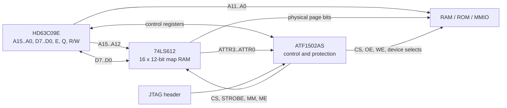

# Espresso-09 Memory Architecture: 74LS612 Mapper + ATF1502AS Control CPLD

**Status:** Proposed architecture  
**Target CPU:** Hitachi HD63C09E / compatible 6809-family CPU  
**Baseline physical RAM:** 1 MiB  
**Logical address space:** 64 KiB  
**Page size:** 4 KiB  
**Revision:** 2026-07-02, revision 3

## 1. Overview

The proposed Espresso-09 memory subsystem divides the MMU into two complementary parts:

- A **74LS612 memory mapper** stores the page-translation table and performs the address translation.
- An **ATF1502AS CPLD** implements policy and control: boot mapping, protection attributes, mapper-register access, memory/device selection, fault handling, and safe write qualification.

This avoids consuming most of a larger CPLD as a bank of mapping registers while retaining programmable protection and control logic.

The baseline design maps sixteen 4 KiB logical pages into a 1 MiB physical address space. Four otherwise-unused bits in every 74LS612 mapping entry are treated as per-page attributes.



## 2. Design goals

- Expand the 6309's 64 KiB logical space without coarse whole-bank switching.
- Use sixteen independently mapped 4 KiB pages.
- Provide a deterministic reset and boot map despite the volatile 74LS612 map RAM.
- Attach protection and validity information to each mapped page.
- Prevent unsafe memory writes while translated address and attribute outputs are settling.
- Keep the control logic field-upgradable through JTAG.
- Use ordinary Verilog-based development and simulation.
- Fit the 44-pin ATF1502AS only through an explicitly pin-budgeted interface.
- Recognise that a 44-pin ATF1504AS adds macrocells but not I/O; a pin-limited design must move to an 84-PLCC or 100-TQFP device.

## 3. 74LS612 organisation

The 74LS612 contains:

- Sixteen 12-bit mapping registers.
- Four map-address inputs, `MA0..MA3`.
- Twelve map outputs, `MO0..MO11`.
- Four independent register-select inputs, `RS0..RS3`.
- A 12-bit register data interface, `D0..D11`.
- Map, pass, register-read, and register-write operating modes.
- Three-state map outputs.

During map mode, `MA0..MA3` select one of the sixteen registers and its 12-bit value appears on `MO0..MO11`.

During pass mode:

- `MA0..MA3` pass through to `MO8..MO11`.
- `MO0..MO7` are forced low.

The pass-mode behaviour is used to create a deterministic identity-mapped first 64 KiB during reset.

## 4. Logical and physical address format

The 6309 logical address is split into:

```text
A15..A12  logical page number: 0..15
A11..A0   4 KiB page offset
```

For the 1 MiB baseline, each 74LS612 entry is interpreted as:

```text
+--------------------------+----------------------+
| 8-bit physical page      | 4-bit attributes     |
| P7..P0                   | ATTR3..ATTR0          |
+--------------------------+----------------------+
```

The resulting physical address is:

```text
PA19..PA12 = physical page P7..P0
PA11..PA0  = CPU A11..A0
```

Therefore:

```text
physical_address = (physical_page << 12) | logical_address[11:0]
```

### Example

If logical page 5 contains physical page `0x23`:

```text
logical address:  0x5ABC
physical address: 0x23ABC
```

## 5. Recommended bit wiring

The wiring below makes an ordinary 8-bit CPU write represent the physical page number naturally while preserving identity mapping in 74LS612 pass mode.

### 5.1 Map-address path

| Source | Destination | Function |
|---|---|---|
| CPU `A12` | 74LS612 `MA0` | Logical page bit 0 |
| CPU `A13` | 74LS612 `MA1` | Logical page bit 1 |
| CPU `A14` | 74LS612 `MA2` | Logical page bit 2 |
| CPU `A15` | 74LS612 `MA3` | Logical page bit 3 |
| CPU `A11..A0` | Memory `A11..A0` | Offset inside 4 KiB page |

### 5.2 Physical-page outputs

| 74LS612 output | Physical address | Page-byte bit |
|---|---|---|
| `MO8` | `PA12` | `P0` |
| `MO9` | `PA13` | `P1` |
| `MO10` | `PA14` | `P2` |
| `MO11` | `PA15` | `P3` |
| `MO4` | `PA16` | `P4` |
| `MO5` | `PA17` | `P5` |
| `MO6` | `PA18` | `P6` |
| `MO7` | `PA19` | `P7` |
| `MO0..MO3` | ATF1502 inputs | `ATTR0..ATTR3` |

The physical page number can therefore be reconstructed as:

```text
P7..P0 = { MO7..MO4, MO11..MO8 }
```

### 5.3 Map-register data bus

| CPU data bit | 74LS612 register-data pin | Stored field |
|---|---|---|
| `D0` | `D8` | `P0` |
| `D1` | `D9` | `P1` |
| `D2` | `D10` | `P2` |
| `D3` | `D11` | `P3` |
| `D4` | `D4` | `P4` |
| `D5` | `D5` | `P5` |
| `D6` | `D6` | `P6` |
| `D7` | `D7` | `P7` |
| ATF1502 attribute driver | `D0..D3` | `ATTR0..ATTR3` |

The ATF1502 must three-state its attribute-driver pins whenever the 74LS612 is reading a register. This prevents contention when the mapper drives `D0..D3`.

## 6. Pass-mode boot map

The 74LS612's internal map RAM has no guaranteed useful power-up contents. The system must therefore reset in pass mode.

Recommended defaults:

```text
MM = 1   pass mode requested
CS = 1   mapper register interface inactive
ME = 0   map outputs enabled
STROBE = 1
```

Pass-through operation requires **both `MM = 1` and `CS = 1`**. `MM` alone is not sufficient: asserting the mapper register interface changes the function of the device.

With the proposed wiring, pass mode produces:

```text
MO8..MO11 = CPU A12..A15
MO4..MO7  = 0
MO0..MO3  = 0
```

This maps the CPU's first 64 KiB directly to physical addresses `0x00000..0x0FFFF`, with all page attributes cleared.

The ATF1502 overlays the boot ROM over the board's selected reset/vector region while leaving RAM beneath it available for later use.

Hardware pull resistors should establish safe inactive states while the CPLD is resetting or being programmed:

- Pull `MM` high for pass mode.
- Pull `CS` and `STROBE` high.
- Pull `ME` high if fail-safe high-impedance mapper outputs are preferred during CPLD reprogramming; otherwise it may be tied active if all memory write controls have independent safe pull-ups.
- Ensure memory `/WE` is pulled inactive independently of CPLD configuration.

A boot test must explicitly cover the fault case `MM = 1`, `CS = 0`; it must not be treated as pass mode.

## 7. Proposed per-page attributes

A useful initial interpretation is:

| Bit | Name | Meaning when set |
|---:|---|---|
| 0 | `WRITE_PROTECT` | Writes to the mapped page are blocked and faulted |
| 1 | `SUPERVISOR_ONLY` | User-mode accesses are blocked and faulted |
| 3..2 | `PAGE_TYPE` | Select RAM, ROM, MMIO, or invalid/fault |

Suggested `PAGE_TYPE` encoding:

| `ATTR3..ATTR2` | Page type |
|---|---|
| `00` | RAM |
| `01` | ROM |
| `10` | MMIO/device page |
| `11` | Invalid/unmapped |

`PAGE_TYPE = 00` is an architectural invariant, not merely a provisional encoding. Pass mode forces `ATTR3..ATTR0 = 0000`, so attribute value zero must continue to mean writable RAM or the reset identity map will no longer boot.

The meanings of the non-zero encodings can still be revised later because all four attribute outputs are routed to the CPLD.

### Physical-memory versus attribute trade-off

The mapper always provides twelve output bits. Bits not used for physical page addressing may be reused as attributes.

```text
physical page bits = log2(physical memory size / 4096)
attribute bits     = 12 - physical page bits
```

| Physical memory | Page bits | Available attributes |
|---:|---:|---:|
| 512 KiB | 7 | 5 |
| 1 MiB | 8 | 4 |
| 2 MiB | 9 | 3 |
| 4 MiB | 10 | 2 |
| 8 MiB | 11 | 1 |
| 16 MiB | 12 | 0 |

The wiring in this document is specifically optimised for **1 MiB plus four attributes**.

## 8. Mapper programming interface

The 44-pin ATF1502 can support this architecture only if the register interface is deliberately kept narrow and high-address decoding is performed outside the CPLD.

### 8.1 Recommended 32-byte MMU block

Provide the CPLD with one externally generated active-low block select, `/MMU_BLOCK`, for a 32-byte logical address range.

```text
offset 0x00..0x0F   74LS612 mapping entries 0..15
offset 0x10..0x17   four-bit CPLD control/status registers
offset 0x18..0x1F   reserved
```

Recommended direct connections:

```text
74LS612 RS0..RS3 = CPU A0..A3
74LS612 R/W      = CPU R/W
```

The CPLD therefore needs only:

- `A4` to distinguish the map window from the control window.
- `A2..A0` to select up to eight control registers.
- `/MMU_BLOCK` from a coarse external decoder.

This avoids bringing `A15..A5` into the ATF1502.

### 8.2 Four-bit control registers

Only CPU `D3..D0` connect to the CPLD register interface. Suggested registers are:

| Offset | Register | Access | Purpose |
|---:|---|---|---|
| `0x10` | `MMU_ATTR` | R/W | Attribute staging nibble |
| `0x11` | `MMU_CTRL` | R/W | Mapper enable, boot overlay and fault control |
| `0x12` | `MMU_FAULT_STATUS` | R/W1C | Fault cause and staging-error indication |
| `0x13` | `MMU_FAULT_PAGE` | R | Logical page involved in the fault |
| `0x14` | `MMU_ATTR_READ` | R | Optional latched attribute readback |
| `0x15..0x17` | Reserved | — | Future use |

Upper data bits `D7..D4` are undefined on reads unless external pull resistors or a bus buffer provide a defined value.

### 8.3 Writing a mapping entry

Software writes the desired attribute nibble, then writes the physical page byte:

```text
write MMU_ATTR, attributes
write MMU_MAP[index], physical_page
```

During the second write:

- CPU `D7..D0` drive the physical-page field through the permuted direct connections.
- The ATF1502 drives the staged attributes onto 74LS612 `D3..D0`.
- The CPLD asserts mapper `CS`.
- CPU `R/W` is already connected directly to the mapper.
- The CPLD generates a valid low pulse on `STROBE`.

All twelve bits enter the selected 74LS612 register simultaneously.

To catch accidental reuse of stale attributes, the CPLD should maintain an `ATTR_FRESH` flag:

1. Writing `MMU_ATTR` sets `ATTR_FRESH`.
2. A successful map-entry write clears it.
3. A map-entry write while it is clear sets a diagnostic bit in `MMU_FAULT_STATUS`.

This remains diagnostic rather than fatal unless firmware chooses to enforce it.

### 8.4 Reading a mapping entry

During a mapper-register read:

- The 74LS612 drives the physical page byte directly onto CPU `D7..D0`.
- It also drives the stored attribute nibble onto its `D3..D0` attribute bus toward the CPLD.
- The CPLD's four mapper-attribute pins must be configured as bidirectional and placed in high impedance.
- The CPLD may latch the attribute nibble for a later read of `MMU_ATTR_READ`.

The page byte and attribute nibble cannot both be returned simultaneously through the CPU's eight-bit data bus with this wiring.

### 8.5 Mapper-register cycles must not access memory

Whenever the mapper register `CS` is active, the CPLD must suppress RAM, ROM and normal MMIO strobes. Mapper outputs may be changing or irrelevant during these cycles.

## 9. ATF1502 responsibilities and pin budget

The ATF1502 should implement:

- Reset-state and boot-overlay control.
- Mapper pass/map mode control.
- Mapper `CS` and `STROBE` generation.
- Four-bit attribute staging latch.
- Three-state control for mapper attribute-data pins.
- Four-bit control/status register interface.
- Per-page access-policy evaluation.
- RAM, ROM and MMIO cycle qualification.
- Safe memory write qualification.
- Fault status and logical-page capture.
- `FIRQ` fault output.
- Optional privilege-state latch.
- JTAG in-system programming.

### 9.1 Package limit

The 44-pin ATF1502AS provides:

```text
32 bidirectional I/O pins
 4 dedicated input pins
```

Retaining JTAG ISP consumes four of the bidirectional I/O pins, leaving:

```text
28 general I/O pins
 4 dedicated input pins
```

The 44-pin ATF1504AS has the same practical pin limit. It adds macrocells, not package I/O.

### 9.2 Pin-budgeted compact interface

A plausible allocation is:

| Signals | Pins | Direction |
|---|---:|---|
| CPU `D3..D0` | 4 | Bidirectional |
| 74LS612 attribute data `D3..D0` | 4 | Bidirectional |
| 74LS612 current attributes `MO3..MO0` | 4 | Input |
| `/MMU_BLOCK`, `A4`, `A2..A0` | 5 | Input |
| CPU `BA`, `BS` | 2 | Input |
| `/RAM_CS`, `/ROM_CS`, `/MMIO_CYCLE` | 3 | Output |
| memory `/WE` | 1 | Output |
| mapper `/CS`, `/STROBE`, `MM` | 3 | Output |
| fault `FIRQ` | 1 | Output |
| Optional memory `/OE` | 0–1 | Output |
| **General-I/O total** | **27–28** |  |
| `E`, `Q`, `R/W`, `/RESET` | 4 | Dedicated inputs |

This leaves at most one general I/O pin. If the CPLD generates memory `/OE`, all 28 non-JTAG I/O pins are consumed.

The mapper `ME` pin should therefore normally be tied active, with memory write safety provided independently. If controllable `ME` is required, another signal must be removed or the design must move to a larger package.

The compact allocation depends on all of the following:

- A coarse external `/MMU_BLOCK` decoder.
- Only four CPU data pins connected to the CPLD.
- CPU `A0..A3` connected directly to mapper `RS0..RS3`.
- CPU `R/W` connected directly to mapper `R/W`.
- No large set of individual peripheral chip selects generated in the CPLD.

The real Verilog design and fixed pin assignment must be run through the fitter before schematic commitment.

### 9.3 When to use a larger package

Move to an ATF1504AS in 84-PLCC or 100-TQFP if any of these are required:

- Full eight-bit CPLD control registers.
- On-chip decoding of most of `A15..A5`.
- Many individual peripheral chip selects.
- More fault-state outputs or DMA controls.
- Additional bus-master or context-switching logic.

A 44-pin ATF1504 is useful only for a macrocell shortage; it does not solve a pin shortage.

## 10. Protection, faults and privilege model

### 10.1 Access checks

For every mapped memory cycle, the CPLD evaluates:

```text
allowed =
    page_is_valid
    AND (not supervisor_only OR supervisor_mode)
    AND (read_cycle OR not write_protect)
```

If the access is not allowed:

- Do not assert RAM, ROM or MMIO access strobes.
- Never assert memory `/WE`.
- Latch the fault cause and logical page.
- Assert the configured fault signal.

### 10.2 Fault semantics on the 6309

The 6809/6309 has no bus-error input and no instruction-restart mechanism. A denied access still appears to complete from the CPU's point of view:

- A denied write is discarded.
- A denied read returns undefined or externally pulled bus data.
- The fault interrupt is taken only at the next interrupt-recognition point.

Consequently, protection faults are suitable for:

- Bug detection.
- Task termination.
- Debugging.
- Preventing accidental writes to kernel or ROM pages.

They cannot support demand paging, copy-on-write or transparent recovery of the faulting instruction.

`FIRQ` is the preferred fault vector because it normally stacks a smaller frame than `IRQ` or `NMI`. `NMI` is not recommended: it is unmaskable and stacks a full frame onto the current system stack, which is especially dangerous if the fault was caused by a corrupted stack pointer. Even `FIRQ` cannot guarantee recovery from a bad stack; the kernel should treat recursive or stack-related faults as fatal.

### 10.3 Privilege entry

The 6309 does not expose a hardware supervisor/user signal. A `SUPERVISOR_ONLY` attribute provides meaningful enforcement only if the privilege latch has a transition mechanism that user code cannot freely reverse.

One basic model is:

1. Reset enters supervisor mode.
2. The kernel performs a one-way write to enter user mode.
3. User mode cannot write MMU control registers or restore supervisor mode.
4. A hardware interrupt or dedicated trap input restores supervisor mode.
5. The kernel switches promptly to a known supervisor stack.

### 10.4 Hardware-visible vector entry using `BA` and `BS`

The HD63C09 exposes Bus Available (`BA`) and Bus Status (`BS`). The processor data sheet defines:

```text
BA = 0, BS = 0   normal running
BA = 0, BS = 1   interrupt or reset acknowledge
BA = 1, BS = 0   SYNC acknowledge
BA = 1, BS = 1   halt or bus grant
```

Interrupt/reset acknowledge is asserted during both cycles of the vector fetch for reset, NMI, FIRQ, IRQ, SWI, SWI2 and SWI3.

This gives the CPLD a genuine hardware-visible supervisor-entry event:

```text
vector_ack = (BA == 0) && (BS == 1)
```

Unlike watching `0xFFF0..0xFFFF` alone, an ordinary user data read of a vector address does not assert the interrupt-acknowledge state and therefore cannot spoof entry.

Recommended behaviour:

1. Leave the vector bytes visible through a fixed ROM/vector overlay during both acknowledge cycles.
2. Set `SUPERVISOR_MODE` when `vector_ack` is observed.
3. Switch to the kernel map only after the complete two-byte vector fetch, or use an overlay that remains stable throughout it.
4. Have the handler switch immediately from the interrupted user stack to a known supervisor stack.

The CPU still pushes its interrupt frame **before** fetching the vector, so the current user stack must be valid and writable. This mechanism improves privilege transitions and bug containment but does not make fault recovery restartable or provide a modern security boundary.

## 11. Safe access timing

### 11.1 Translation path

The SN74LS612 data sheet specifies a maximum map-address-to-map-output access time of **70 ns** at its stated 5 V, 25 °C switching conditions.

With 15 ns SRAM:

```text
mapper address path = 70 ns
SRAM address access = 15 ns
--------------------------------
estimated data path = 85 ns
```

If RAM selection depends on attributes passing through a 7.5 ns CPLD path:

```text
mapper attribute path = 70 ns
CPLD policy path       = 7.5 ns
SRAM chip-enable path  = 15 ns
--------------------------------
estimated CE path      = 92.5 ns
```

These are preliminary path estimates, not a completed timing proof. The final design must include:

- HD63C09E address-valid timing.
- `E` and `Q` phase relationships.
- CPU data setup and hold times.
- CPLD speed grade and fitted path delay.
- Mapper loading and board capacitance.
- SRAM `tAA`, `tCE`, `tOE` and write timing.
- Temperature and voltage margins.

### 11.2 Read and write side-effect safety

The translated address and attributes are not immediately valid after `A15..A12` changes. This affects reads as well as writes.

A transient decode onto RAM is normally harmless if no read/write strobe is active. A transient decode onto MMIO may not be harmless: reading a UART data register can remove a byte, and some status registers clear flags when read.

The CPLD must therefore qualify **every side-effecting access signal** with a bus phase that occurs after the mapper has settled:

- SRAM `/WE`.
- SRAM `/OE` or read strobe when needed.
- MMIO read and write strobes.
- Any peripheral chip select whose assertion alone has side effects.

At 3 MHz, address translation should normally settle before the useful `E`-high access interval. The exact implementation is device-specific:

- For asynchronous devices, qualify `/CS`, `/OE` and `/WE` with the valid `E` phase.
- For 6800-family peripherals that require chip select setup before `E` rises, generate a stable predecode after mapper settling and use `E` as the device's actual transfer clock/strobe.
- Do not assume that qualifying `/WE` alone is sufficient.

### 11.3 Write safety

Do not derive SRAM `/WE` directly from CPU `R/W`.

The CPLD must assert `/WE` only when:

- Logical address is stable.
- Mapper outputs and attributes are stable.
- Page policy permits the write.
- SRAM chip select is valid.
- CPU write data is valid.
- The selected `E/Q` phase satisfies CPU and SRAM timing.

A conservative design may generate `/WE` from a registered or phase-qualified CPLD term.

### 11.4 Mapper-register write timing

The mapper requires, under its published operating conditions:

- A minimum 75 ns low `STROBE` pulse.
- Address, control and data setup/hold requirements around the end of the strobe.

A 3 MHz 6309 provides enough raw cycle time, but `STROBE` generation must be checked against actual `E/Q` and write-data timing rather than inferred only from the nominal 333 ns cycle period.

## 12. Electrical considerations

### 12.1 TTL-level compatibility

The 74LS612 guarantees TTL-level outputs. Any SRAM, ROM or CPLD input driven by its map outputs must accept a TTL high level; do not assume every 5 V CMOS memory has a sufficiently low `VIH`.

Preferred options:

- Select memories with explicitly TTL-compatible inputs.
- Add an HCT-family buffer if level compatibility is uncertain.
- Include the buffer's propagation delay in the timing analysis.

### 12.2 74HCT612 option

A ZyMOS 74HCT612 preliminary data sheet exists and describes a pin-compatible CMOS mapper. Under its stated 5 V, 25 °C, 50 pF test conditions it specifies approximately:

```text
map-mode MA to MO maximum      70 ns
pass-mode MA to MO maximum     30 ns
static supply current maximum   1 mA
dynamic supply current         10 mA
```

This is a major power improvement over the bipolar LS part.

However, the same preliminary data sheet guarantees `VOH = 2.4 V` at `IOH = -6 mA`. It therefore does **not** by itself eliminate the need to verify the receiving SRAM's `VIH`. At light load the actual high level will normally be much closer to 5 V, but that is not the same as a guaranteed full-CMOS output specification.

Other caveats:

- The available document is marked preliminary.
- The part is obsolete/NOS and provenance may be uncertain.
- Its exact timing and electrical limits must be tied to the actual manufacturer's marking on the purchased devices.

The board may use the available 74LS612 batch initially while retaining a socket or compatible footprint for a verified HCT612 substitution.

### 12.3 74LS612 power consumption

The SN74LS612 data sheet lists supply current as high as approximately 230 mA in some output states.

Worst-case mapper power is therefore approximately:

```text
P = V x I
P = 5 V x 0.230 A
P = 1.15 W
```

Board recommendations:

- Place at least one 100 nF ceramic capacitor directly at the device.
- Add local bulk capacitance near the mapper and RAM.
- Use low-impedance 5 V and ground planes.
- Include the mapper in regulator, connector and thermal calculations.
- Expect the LS part to run noticeably warm.

### 12.4 Safe defaults during JTAG programming

During CPLD reprogramming:

- Hold the CPU in reset.
- Keep memory `/WE` inactive using a hardware pull resistor.
- Keep mapper `CS` and `STROBE` inactive.
- Prefer a pull-up on `ME` if the CPLD controls it.
- Do not rely solely on the current CPLD image to prevent writes while that image is being replaced.

## 13. Boot sequence

A recommended firmware sequence is:

1. Reset with the 74LS612 in pass mode.
2. Execute from the CPLD-controlled boot ROM overlay.
3. Initialise the attribute staging register.
4. Write all sixteen mapper entries.
5. Initialise fault and privilege state.
6. Ensure the currently executing page, stack page, and vector page have valid mappings.
7. Enable map mode.
8. Verify execution in the translated map.
9. Disable or relocate the boot ROM overlay when desired.

Map mode must not be enabled until the page containing the next instruction is valid under the new translation table.

## 14. Context switching

A single mapper contains one active set of sixteen translations. It does not provide the GIME's dual hardware task maps.

A complete reload requires approximately:

```text
16 attribute writes
16 physical-page writes
plus loop and register overhead
```

For GameOS this is likely acceptable. The actual context-switch time should be measured with the final mapper-load routine before adding more hardware.

Possible later extensions:

- A second mapper for two instantly selectable contexts.
- A shadow table in kernel RAM with an optimised mapper-load routine.
- A DMA or MCU-assisted mapper reload.
- A larger-package ATF1504 for more fault, lock or context-control state.

## 15. Bus-master and DMA considerations

The proposed mapper translates CPU accesses only.

Any future bus master must use one of these models:

- Generate physical addresses directly and bypass the mapper.
- Drive the 74LS612 `MA` inputs while the CPU bus is relinquished.
- Use a separate translation context.
- Restrict DMA to a fixed common physical region.

This decision should be made before adding DMA-capable peripherals.

## 16. Verification plan

### Logic simulation

Create testbenches for:

- Pass-mode identity mapping with `MM = 1` and `CS = 1`.
- Non-pass behaviour when `MM = 1` but mapper `CS = 0`.
- All sixteen map entries.
- Page-byte permutation from CPU data to physical address.
- Attribute staging and simultaneous 12-bit writes.
- Stale-attribute detection.
- RAM, ROM, MMIO and invalid page types.
- Mid-cycle attribute and page-type transients.
- E-qualified MMIO read/write strobes.
- User/supervisor access combinations.
- Write-protected pages.
- Fault latching and clearing.
- Denied-read and denied-write completion semantics.
- Mapper-register readback.
- `BA`/`BS` vector-acknowledge detection for every interrupt type.
- Confirmation that ordinary reads of vector addresses do not enter supervisor mode.
- Map switching only after the complete two-byte vector fetch.
- JTAG/reset-safe output defaults.

### Fitter validation

Before schematic commitment:

- Assign every package pin.
- Preserve all four JTAG pins.
- Confirm the four mapper attribute-data pins are fitted as bidirectional I/O.
- Confirm the dedicated input pins accept the intended `E`, `Q`, `R/W` and `/RESET` signals.
- Confirm that `BA` and `BS` fit as ordinary inputs while all four JTAG pins remain reserved.
- Verify that the design fits the ATF1502AS with acceptable product-term and routing utilisation.
- Treat a pin failure as requiring external decode reduction or a larger package; a 44-pin ATF1504 does not add I/O.

### Hardware validation

Measure:

- `MA` transition to stable `MO`.
- `MO`/attribute transition to valid RAM and MMIO strobes.
- CPU address transition to safe `/OE` and `/WE`.
- Absence of read-sensitive MMIO glitches before `E`.
- Mapper `STROBE` width and setup/hold margins.
- SRAM read-data validity relative to CPU sampling.
- 5 V rail droop and mapper temperature.
- Behaviour while programming the CPLD through JTAG.

## 17. Open decisions

- Final installed RAM size.
- Final non-zero attribute encoding.
- Boot ROM location and overlay size.
- Source of the external `/MMU_BLOCK` decode.
- Exact 32-byte MMU block address.
- Whether memory `/OE` and mapper `ME` require CPLD pins.
- Whether mapper attribute readback is required.
- Whether stale attributes are diagnostic or fatal.
- Exact fault policy and `FIRQ` handling.
- Hardware mechanism for user-to-supervisor transitions.
- Exact sequencing for `BA`/`BS`-assisted supervisor entry and kernel-map activation.
- Whether page 15/vector space receives an additional hardware lock.
- Exact SRAM part and confirmation of TTL-compatible inputs.
- Whether to populate LS612 or a verified HCT612.
- Final 6309 timing proof for every side-effecting read/write strobe.
- Successful ATF1502 fitter result with the intended fixed pinout.

## 18. Sources

- Texas Instruments, **SN54LS610 through SN54LS613 / SN74LS610 through SN74LS613 Memory Mappers**:  
  <https://media.digikey.com/pdf/Data%20Sheets/Rochester%20PDFs/SN54LSS61x_SN74LS61x.pdf>

- Microchip, **ATF1502AS/ATF1502ASL 5V 32-Macrocell CPLD Data Sheet**:  
  <https://ww1.microchip.com/downloads/aemDocuments/documents/MPD/ProductDocuments/DataSheets/ATF1502AS-ATF1502ASL-5V-32-Macrocell-CPLD-Data-Sheet-20006619A.pdf>

- ZyMOS, **74HCT612 Memory Mapper Preliminary Data Sheet**:  
  <https://www.alldatasheet.com/datasheet-pdf/pdf/1652557/ETC/74HCT612.html>

- Stuart Conner, **Mini-Cortex System** (74LS612 + GAL22V10 precedent):  
  <https://www.stuartconner.me.uk/mini_cortex/mini_cortex.htm>

- Hitachi, **HD6309/HD63C09 Hardware Data Sheet** (BA/BS state encoding and interrupt-vector acknowledge):  
  <https://docs.rs-online.com/66c7/0900766b8002c50e.pdf>
